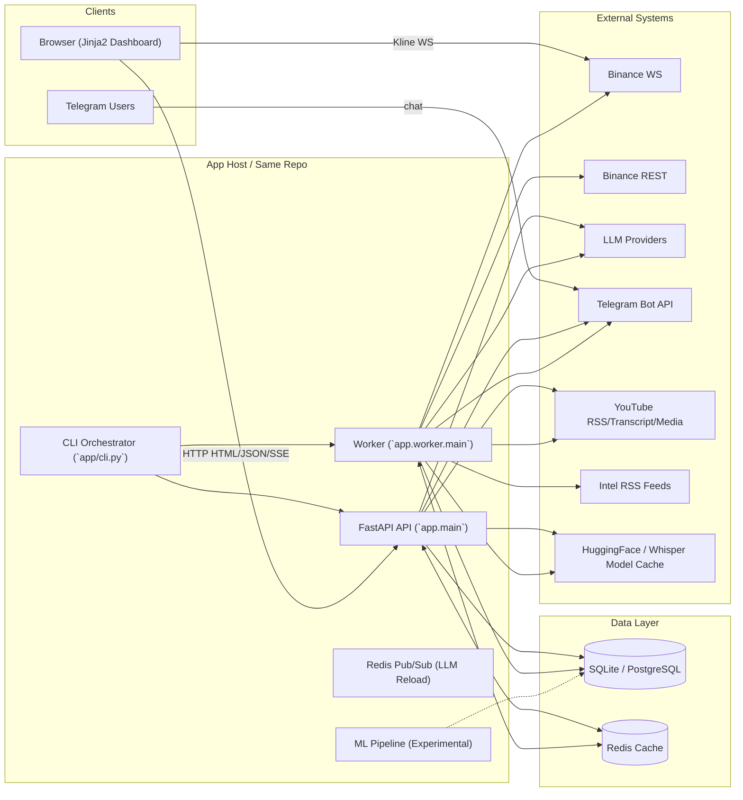
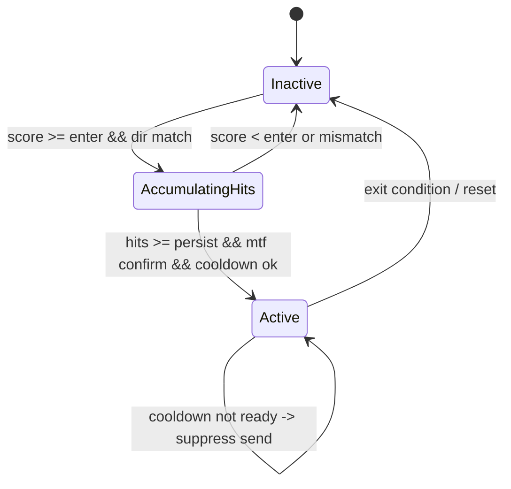

# Crypto Sentinel 系统架构与协作分析报告

> 文档版本：`v2.4`  
> 更新时间：`2026-03-06`  
> 生成口径：基于当前仓库代码实现（As-Is），并补充建议演进方向（To-Be）  
> 适用范围：`crypto_sentinel` 单体代码库（API + Worker 双进程协作）

## 目录

1. [摘要](#摘要)
2. [总体架构与技术栈](#总体架构与技术栈)
3. [前端技术选型与渲染流程](#前端技术选型与渲染流程)
4. [后端服务架构与 API 设计](#后端服务架构与-api-设计)
5. [前后端通信协议与数据交互机制](#前后端通信协议与数据交互机制)
6. [数据库设计与数据流](#数据库设计与数据流)
7. [调度器与 Worker 架构](#调度器与-worker-架构)
8. [核心功能模块业务逻辑拆解](#核心功能模块业务逻辑拆解)
9. [关键代码路径时序分析](#关键代码路径时序分析)
10. [状态机分析](#状态机分析)
11. [环境配置差异与部署策略](#环境配置差异与部署策略)
12. [非功能性设计](#非功能性设计)
13. [性能瓶颈与优化方案](#性能瓶颈与优化方案)
14. [安全机制实现与风险分析](#安全机制实现与风险分析)
15. [错误处理与监控告警体系](#错误处理与监控告警体系)
16. [质量保障与测试策略](#质量保障与测试策略)
17. [交付物标准与验收条件](#交付物标准与验收条件)
18. [程序可改进的地方（全面问题清单）](#程序可改进的地方全面问题清单)
19. [后期拓展方向](#后期拓展方向)
20. [附录](#附录)

## 摘要

- `Crypto Sentinel` 代码形态是单体仓库，但运行态为 `CLI 编排 + API 进程 + Worker 进程 + 共享数据库` 的协作系统。
- 前端为 `FastAPI + Jinja2 模板 + 原生 JavaScript + SSE` 的服务端渲染方案，覆盖市场总览、告警中心、YouTube 观点、策略回放与账户监控。
- 核心技术栈：`FastAPI/Uvicorn`、`APScheduler`、`SQLAlchemy/Alembic`、`httpx/websockets`、`pandas/numpy`、`OpenAI-compatible LLM SDK`、`Redis` (用于热更新与协作)。
- **新增模块**：`AI Grounding Engine`（事实校验）、`Telegram Agent`（交互式会话）、`ML Pipeline`（实验性模型训练/预测）、`Signal Processing`（市场状态分类）。
- 主业务链路包含：行情采集/聚合 → 指标计算 → 异常检测/告警 → AI 市场分析（含事实校验） → Telegram 推送；YouTube 链路含视频发现 → 字幕/ASR → VTA 洞察 → 共识 → 注入 AI 上下文；Intel 链路覆盖 RSS 情报采集 → 关键词/实体标注 → 风险温度摘要 → 前端看板。
- 策略回放链路包含 `strategy_decisions`、评估回放、得分与特征统计；账户监控链路通过期货/杠杆账户快照落库与 UI 展示。
- 跨进程协作依赖数据库与 LLM 热更新（Redis Pub/Sub 或 signal/ack 文件协议）；运维观测覆盖 `llm_calls`、`ai_analysis_failures` 与 `job_metrics` 文件快照。

## 总体架构与技术栈

### 现状实现

#### 运行与服务框架
- Python `>=3.11`（`pyproject.toml`）
- API：`FastAPI + Uvicorn`（`app/main.py`）
- 前端模板：`Jinja2`（`app/web/views.py` 及 `app/web/routers/*`）
- Worker：`asyncio + APScheduler`（`app/worker/main.py`, `app/scheduler/scheduler.py`）
- 配置：`Pydantic Settings + .env`（`app/config.py`）
- 任务编排：CLI（`app/cli.py`, `sentinel up`）

#### 数据与迁移
- ORM：`SQLAlchemy 2.x`（`app/db/models.py`）
- 迁移：`Alembic`（`app/db/migrations/versions/*`）
- 默认数据库：`SQLite`
- 可选数据库：`PostgreSQL`（`docker-compose.yml`）
- **Redis**：用于 LLM 热更新信令与任务队列（`redis>=5.0.0`）

#### 外部集成
- 行情：Binance `REST + WebSocket`（`app/providers/binance_provider.py`）
- AI：`openai` SDK + 自定义 Provider 封装（`app/ai/openai_provider.py`）
- YouTube：`RSS / Transcript API / yt-dlp / faster-whisper`（`app/providers/youtube_provider.py`）
- Intel 情报：`RSS` 聚合 + 关键词标注（`app/news/service.py`）
- 消息：Telegram Bot API（Webhook + Polling + Agent）

### 分层结构与模块划分

| 层级 | 职责 | 关键模块 |
|---|---|---|
| 表现层 | 页面渲染、交互与流式展示 | `app/web/templates/*`, `app/web/static/*` |
| API 层 | 路由编排、参数校验、SSE 流 | `app/web/routers/*`, `app/web/routes/*` |
| 业务层 | 行情处理、告警、AI 评估、YouTube 分析、Intel 情报 | `app/scheduler/*`, `app/features/*`, `app/ai/*`, `app/alerts/*`, `app/news/*`, `app/signals/*` |
| 智能层 | LLM 调用、事实校验、ML 预测 | `app/ai/grounding/*`, `app/ml/*`, `app/ai/analyst.py` |
| 数据层 | ORM、迁移、仓储访问 | `app/db/*` |
| 集成层 | Binance/Telegram/YouTube/LLM 接入 | `app/providers/*`, `app/ai/openai_provider.py` |
| 运维层 | CLI 启动、健康诊断、日志 | `app/cli.py`, `app/logging.py` |

### 技术栈明细与选型对比

| 类别 | 当前选型（版本） | 选型理由（现状） | 替代方案对比 |
|---|---|---|---|
| 语言/运行时 | Python `>=3.11` | 生态完整、数据处理与 AI SDK 成熟 | Go/Rust（性能更高但生态与研发成本更大） |
| Web 框架 | FastAPI `>=0.115.0` | 内置 OpenAPI、异步友好、模板渲染可用 | Flask + extensions / Django（更传统但更重） |
| ASGI Server | Uvicorn `>=0.30.0` | 与 FastAPI 配套、部署简化 | Hypercorn / Gunicorn+uvicorn |
| 前端 | Jinja2 `>=3.1.4` + 原生 JS | 服务端渲染，改造成本低 | React/Vue SPA（开发复杂度更高） |
| ORM | SQLAlchemy `>=2.0.30` | 成熟 ORM + 可迁移 | Django ORM / Peewee |
| 迁移 | Alembic `>=1.13.1` | 与 SQLAlchemy 集成紧密 | Django migrations |
| 调度 | APScheduler `>=3.10.4` | 轻量定时任务，适合单进程 Worker | Celery Beat（需 MQ） |
| 数据分析 | pandas `>=2.2.2`, numpy `>=2.0.0` | 指标计算与聚合便利 | Polars（性能高但需要改写） |
| LLM SDK | openai `>=1.40.0` | 兼容多 Provider 通道 | LangChain（更重） |
| 网络客户端 | httpx `>=0.27.0`, websockets `>=12.0` | 异步请求/WS 友好 | requests + websocket-client |
| 数据库 | SQLite（默认）/ Postgres `16`（Compose） | 本地易用 + 生产可迁移 | MySQL / ClickHouse |
| 容器 | Docker (python:3.11-slim) | 统一运行环境 | Distroless/Alpine（更轻但调试成本高） |
| 缓存/信令 | Redis `>=5.0.0` | 跨进程通信、热更新 | 文件锁（旧方案）/ RabbitMQ |
| 消息队列 | 未引入 | 任务规模有限 | RabbitMQ / Kafka / Redis Streams |
| 网关 | 未引入 | 直接暴露 FastAPI | Nginx/Traefik/API Gateway |
| 监控/告警 | logging + `job_metrics.json` + `/api/health` | 轻量可用 | Prometheus + Grafana + Sentry |
| CI/CD | GitHub Actions | 基础构建与测试 | GitLab CI |
| 测试 | pytest `>=8.3.0`, pytest-cov `>=5.0.0` | 现有测试基于 pytest | unittest / nose |

### 关键代码路径/模块

- 入口：`app/main.py`, `app/worker/main.py`, `app/cli.py`
- 配置中心：`app/config.py`
- 调度器：`app/scheduler/scheduler.py`
- AI 校验：`app/ai/grounding/engine.py`
- 信号处理：`app/signals/regime.py`, `app/signals/decision.py`
- Telegram Agent：`app/alerts/telegram_agent.py`
- ML 实验：`app/ml/*`

### 数据/控制流

- `CLI` 启动 API 与 Worker 两个子进程（`app/cli.py`）。
- API 负责页面渲染、管理接口、手动触发、SSE 流。
- Worker 负责行情订阅、周期任务、外部轮询、告警推送。
- Intel RSS 采集与摘要生成在 Worker 内以定时任务运行，结果提供给 API 展示与 AI 上下文。
- 两进程通过共享数据库和 LLM 热更新（Redis Pub/Sub 或文件信号）协作。

### 风险与边界

- 单体代码库易部署，但核心文件（`app/scheduler/jobs.py`）职责聚合严重。
- DB 初始化路径存在 `Alembic` 与 `create_all` 混用，存在 schema 演进不一致风险。
- `app/web/views.py` 虽有拆分但仍承载大量逻辑。

### 系统总体架构图（System Architecture）

图示：当前运行态的核心组件、外部依赖、共享数据库与 LLM 热更新协作链路。



简要解读：
- API 与 Worker 不直接 RPC，主要通过 DB 和 Redis 协作。
- 浏览器与 API 的长任务交互依赖 `SSE`。
- Telegram 入站支持 `Webhook`（API）与 `Polling`（Worker）两条链路，新增 `Agent` 模式增强交互。

### 目录结构说明

```
app/                # 核心业务代码
  agents/           # Telegram Agent 工具集
  ai/               # LLM 调用、Grounding 校验、Context 构建
    grounding/      # 事实校验引擎与验证器
  alerts/           # 告警推送、Telegram Agent/Dispatcher
  db/               # ORM/迁移/仓储
  features/         # 指标与特征计算
  ml/               # 机器学习实验（训练/预测）
  news/             # Intel/RSS 情报聚合
  ops/              # 运维指标监控
  providers/        # 外部集成（Binance/YouTube）
  scheduler/        # APScheduler 与任务实现
  signals/          # 信号处理、状态机、决策逻辑
  storage/          # Blob 存储
  strategy/         # 策略回放、决策栈、Manifest
  utils/            # 通用工具
  web/              # Web 层
    routers/        # API 路由定义
    routes/         # 路由实现
    templates/      # Jinja2 模板
  worker/           # Worker 进程入口
docs/               # 项目文档
docker/             # Dockerfile 与 Compose
scripts/            # 启动与工具脚本
tests/              # pytest 测试
```

## 前端技术选型与渲染流程

### 现状实现

当前前端是“服务端渲染 + 原生 JS 增量交互”的模板前端，而不是 SPA。

#### 页面与静态资源
- 页面模板：
- `app/web/templates/overview.html`
- `app/web/templates/alerts.html`
- `app/web/templates/intel.html`
- `app/web/templates/youtube.html`
- `app/web/templates/llm_debug.html`
- `app/web/templates/strategy.html`
- `app/web/templates/account.html`
- 样式：
- `app/web/static/styles.css`
- `app/web/static/strategy.js`
- Tailwind CDN（模板内加载）
- 图标/字体：
- Lucide CDN
- Google Fonts（模板内加载）
- 国际化：
- `app/web/static/i18n.js`

#### 渲染与交互模式
- 首屏：FastAPI + Jinja2 服务端渲染。
- 交互：浏览器使用原生 `fetch` 调用 JSON API。
- 长任务：使用 `EventSource` 消费 `SSE`（AI 分析流、ASR 进度）。
- 部分 UI 刷新采用“重新抓取页面 HTML 后局部替换”的策略（`overview.html`）。
- 策略回放页面使用 `lightweight-charts` 绘制 K 线，优先通过浏览器直连 Binance WS 增量刷新，失败则回退到 `/api/ohlcv` 的增量轮询。

### 关键代码路径/模块

- 路由与模板上下文：`app/web/routers/pages.py`
- 页面脚本：`app/web/templates/overview.html`, `app/web/templates/intel.html`, `app/web/templates/youtube.html`, `app/web/templates/llm_debug.html`
- I18N：`app/web/static/i18n.js`

### 数据/控制流

- API 从 DB 拉取快照、告警、AI 信号、YouTube 状态与 Intel 摘要，渲染模板。
- 浏览器加载后以原生 JS 进行操作：
- 本地 DOM 过滤/排序
- 调用 `/api/*` 接口刷新
- 订阅 `SSE` 展示流式状态

### 风险与边界

- 模板内嵌大量 JS，维护性逐步变差。
- 对 CDN 的依赖不利于生产 CSP 与离线部署。
- `i18n.js` 与模板文本存在编码/字符显示异常风险（需统一 UTF-8 治理）。

### 目标方案（如适用）

- 继续保留模板前端，但做“模板前端工程化”：
- 抽离模板内脚本到静态 JS 模块
- 统一 API/SSE 客户端封装
- 本地化静态资源，降低 CDN 依赖

## 后端服务架构与 API 设计

### 现状实现

- 应用入口：`app/main.py`
- 主要路由模块：
- `app/web/routers/*`（API 分组定义）
- `app/web/routes/*`（API 逻辑实现）
- `app/web/api_telegram.py`（Telegram Webhook）

### 关键代码路径/模块

- `app/main.py`
- `app/web/routers/api_market.py`
- `app/web/routers/api_ai.py`

### API 路由矩阵（核心）

| 分组 | 方法 | 路径 | 返回 | 主要用途 |
|---|---|---|---|---|
| 页面 | GET | `/` | HTML | 市场总览页 |
| 页面 | GET | `/alerts` | HTML | 告警中心 |
| 页面 | GET | `/intel` | HTML | Intel 情报中心 |
| 页面 | GET | `/youtube` | HTML | YouTube 管理与分析页 |
| 页面 | GET | `/llm` | HTML | LLM 调试页 |
| 页面 | GET | `/strategy` | HTML | 策略回放与研究 |
| 页面 | GET | `/account` | HTML | 账户监控 |
| 核心 | GET | `/api/market` | JSON | 市场快照 |
| 核心 | GET | `/api/alerts` | JSON | 告警列表 |
| 核心 | GET | `/api/health` | JSON | API/DB/Worker 健康状态 |
| 核心 | GET | `/api/models` | JSON | LLM 模型列表 |
| 核心 | GET | `/api/ai-signals` | JSON | AI 信号列表 |
| 核心 | GET | `/api/ohlcv` | JSON | K 线与历史窗口 |
| 核心 | GET | `/api/account/futures` | JSON | 合约账户快照 |
| 核心 | GET | `/api/account/margin` | JSON | 杠杆账户快照 |
| 策略 | GET | `/api/strategy/decisions` | JSON | 策略决策列表（raw/densified） |
| 策略 | GET | `/api/strategy/decisions/{decision_id}` | JSON | 决策详情 |
| 策略 | GET | `/api/strategy/scores` | JSON | 策略评分窗口 |
| 策略 | GET | `/api/strategy/feature-stats` | JSON | 策略特征统计 |
| Intel | GET | `/api/intel/news` | JSON | Intel 新闻列表 |
| Intel | GET | `/api/intel/digest` | JSON | Intel 摘要与风险温度 |
| AI | POST | `/api/ai-analyze` | JSON | 手动触发 AI 分析（含 dry_run） |
| AI | GET | `/api/ai-analyze/stream` | SSE | 手动 AI 分析流 |
| YouTube | POST | `/api/youtube/sync` | JSON | 手动同步视频/字幕 |
| YouTube | GET | `/api/youtube/asr/model` | JSON | ASR 模型状态 |
| YouTube | POST | `/api/youtube/asr/model` | JSON/SSE | 下载 ASR 模型 |
| YouTube | POST | `/api/youtube/asr/{video_id}` | JSON/SSE | 手动 ASR 转写 |
| YouTube | GET | `/api/youtube/channels` | JSON | 频道列表 |
| YouTube | POST | `/api/youtube/channels` | JSON | 添加频道 |
| YouTube | DELETE | `/api/youtube/channels/{channel_id}` | JSON | 删除频道 |
| YouTube | GET | `/api/youtube/videos` | JSON | 视频列表/状态 |
| YouTube | GET | `/api/youtube/transcript/{video_id}` | JSON | 转写与洞察详情 |
| YouTube | POST | `/api/youtube/analyze/{video_id}` | JSON | 手动重排队 AI 分析 |
| YouTube | GET | `/api/youtube/consensus` | JSON | 最新观点共识 |
| LLM | GET | `/api/llm/config` | JSON | 读取 LLM 配置（脱敏） |
| LLM | POST | `/api/llm/config` | JSON | 写 `.env` 并触发热更新 |
| LLM | GET | `/api/llm/status` | JSON | 热更新状态与 ACK |
| LLM | GET | `/api/llm/calls` | JSON | LLM 调用日志 |
| LLM | GET | `/api/llm/failures` | JSON | LLM 解析/校验失败记录 |
| LLM | POST | `/api/llm/selfcheck` | JSON | LLM 连通性自检 |
| Telegram | POST | `/api/telegram/webhook` | JSON | Telegram Webhook 入站 |
| Ops | GET | `/api/ops/jobs` | JSON | 任务执行统计与快照 |

### API 定义与文档

- FastAPI 默认提供 OpenAPI 文档（`/docs`, `/redoc`）。
- 详细返回结构以路由实现为准：`app/web/routers/*`。

### 数据/控制流

- 页面路由：DB -> Jinja2 -> HTML
- 普通 API：DB/外部系统 -> JSON
- 长任务 API：生成器/后台任务 -> `SSE`
- 管理 API：写 `.env` / 写 DB / 触发下载或分析

### 风险与边界

- 管理型 API（LLM 配置、ASR 下载、手动分析）默认无统一鉴权，生产风险高。

### 目标方案（如适用）

- 管理 API 必须加鉴权与审计
- 流式与高成本接口增加限流与配额

## 前后端通信协议与数据交互机制

### 现状实现

| 通信方向 | 协议 | 载荷 | 代表模块 |
|---|---|---|---|
| Browser -> API | HTTP | HTML / JSON | `app/web/routers/*` |
| Browser -> API | SSE | `text/event-stream` | `/api/ai-analyze/stream` 等 |
| Browser -> Binance | WebSocket | JSON | `app/web/static/strategy.js`（K 线实时更新） |
| Worker -> Binance | WebSocket | JSON | `app/providers/binance_provider.py` |
| API/Worker -> 外部系统 | HTTPS | JSON / XML / HTML | `httpx` 调用 |
| Telegram -> API | HTTPS Webhook | JSON | `app/web/api_telegram.py` |
| Worker -> Telegram | HTTPS Polling/API | JSON | `app/alerts/telegram_poller.py`, `app/alerts/telegram.py` |
| API <-> Worker | Redis Pub/Sub（默认）/ 文件协议（回退） | `llm:reload` 事件 / JSON signal/ack | `app/ai/llm_runtime_reload.py`, `app/worker/llm_hot_reload.py` |
| API/Worker <-> DB | SQLAlchemy | ORM/SQL | `app/db/*` |

### 关键代码路径/模块

- SSE：`app/web/routers/api_ai.py`
- Binance WS：`app/providers/binance_provider.py`
- 前端 WS：`app/web/static/strategy.js`（Browser 直连 Binance WS + 自动回退轮询）
- Telegram Webhook/Polling：`app/web/api_telegram.py`, `app/alerts/telegram_poller.py`
- LLM 热更新：`app/ai/llm_runtime_reload.py`, `app/worker/llm_hot_reload.py`（Redis Pub/Sub 或文件协议）

### 数据/控制流

- 前端长任务通过 SSE 获取 token/chunk/阶段性进度。
- Worker 行情采集使用 Binance WS，补数/多周期同步使用 REST。
- 策略回放页前端优先使用 Binance WS 推送 K 线，异常时回退 `/api/ohlcv` 增量刷新。
- API 与 Worker 的 LLM 热更新：**Redis 模式**（默认）采用 `llm:reload` Pub/Sub 事件，Worker 订阅后实时应用并写 ACK 到 Redis；**文件模式**（`LLM_HOT_RELOAD_USE_REDIS=false`）采用 signal -> heartbeat 轮询 -> ack。

### 风险与边界

- SSE 缺少统一的断连取消策略。
- 文件协议（回退模式）适用于单机/共享卷，不适合多副本 Worker。

### 目标方案（如适用）

- 保留 SSE 用于运维型 UI（足够轻量）。
- 多 Worker 部署使用 Redis 模式（默认）；文件模式仅用于无 Redis 的单 Worker 场景。

## 数据库设计与数据流

### 现状实现

数据模型定义在 `app/db/models.py`，仓储逻辑在 `app/db/repository.py`。大量结构化扩展字段使用 JSON 存储以提高灵活性。

### 关键代码路径/模块

- 模型：`app/db/models.py`
- Session/Engine：`app/db/session.py`
- 仓储：`app/db/repository.py`
- 迁移：`app/db/migrations/versions/*`

### 表模型清单（按域）

| 域 | 表 | 用途 |
|---|---|---|
| 市场数据 | `ohlcv` | 原始与聚合 K 线（1m/5m/10m/15m/1h/4h） |
| 市场指标 | `market_metrics` | 指标结果（RSI/MACD/ATR/BB/OBV 等） |
| 告警事件 | `alert_events` | 异常告警记录与去重 UID |
| 告警状态机 | `anomaly_state` | 告警状态持久化（hit/cooldown/active） |
| 资金费率 | `funding_snapshots` | Funding/OI 快照 |
| AI 信号 | `ai_signals` | LLM 信号与分析 JSON |
| 策略 | `strategy_decisions` | 策略决策与回放索引 |
| 策略 | `strategy_decision_stack` | 策略决策栈详细日志（新） |
| 策略 | `decision_executions` | 回放执行与填单结果 |
| 策略 | `decision_evals` | 回放评估结果（TP/SL/OUTCOME） |
| 策略 | `strategy_scores` | 评分窗口统计 |
| 策略 | `strategy_feature_stats` | 特征统计分桶 |
| 账户监控 | `futures_account_snapshots` | 合约账户快照 |
| 账户监控 | `margin_account_snapshots` | 杠杆账户快照 |
| 账户统计 | `account_stats_daily` | 每日账户统计与冷钱包记录（新） |
| Worker 状态 | `worker_status` | 心跳/版本/运行状态 |
| Intel | `news_items` | 新闻条目、标签、风险评分 |
| Intel | `intel_digest_cache` | Intel 摘要与风险温度缓存 |
| YouTube | `youtube_channels` | 频道配置 |
| YouTube | `youtube_videos` | 视频元数据/字幕/ASR 状态 |
| YouTube | `youtube_insights` | 单视频 AI 洞察（VTA） |
| YouTube | `youtube_consensus` | 聚合共识结果 |
| LLM 观测 | `llm_calls` | 调用日志、耗时、错误摘要、tokens |
| LLM 失败 | `ai_analysis_failures` | AI 解析/校验失败事件 |
| Telegram 记忆 | `telegram_sessions` | 会话上下文/偏好 |
| Telegram 审计 | `telegram_message_log` | 对话与工具调用日志 |
| 模型版本 | `model_versions` | 预留模型版本登记 |

### 表结构摘要（关键表字段）

| 表 | 关键字段（摘录） | 说明 |
|---|---|---|
| `ohlcv` | `symbol`, `timeframe`, `ts`, `open/high/low/close`, `volume` | K 线基础数据 |
| `market_metrics` | `symbol`, `timeframe`, `ts`, `rsi_14`, `macd_hist`, `atr_14`, `bb_bandwidth`, `ema_ribbon_trend` | 指标结果 |
| `ai_signals` | `symbol`, `ts`, `direction`, `entry_price`, `stop_loss`, `take_profit`, `analysis_json` | AI 信号落库 |
| `strategy_decisions` | `symbol`, `decision_ts`, `manifest_id`, `position_side`, `entry_price` | 策略决策主表 |
| `strategy_decision_stack` | `decision_id`, `layer_name`, `input_snapshot`, `output_decision`, `reasoning` | 决策层级日志 |
| `decision_evals` | `decision_id`, `tp_hit`, `sl_hit`, `outcome_raw`, `r_multiple_raw` | 回放评估结果 |
| `strategy_scores` | `manifest_id`, `window_start_ts`, `win_rate`, `avg_r`, `split_type` | 策略评分窗口 |
| `strategy_feature_stats` | `manifest_id`, `feature_key`, `bucket_key`, `win_rate` | 特征统计分桶 |
| `futures_account_snapshots` | `ts`, `available_balance`, `btc_position_amt`, `btc_mark_price` | 合约账户快照 |
| `margin_account_snapshots` | `ts`, `margin_level`, `margin_call_bar`, `force_liquidation_bar` | 杠杆账户快照 |
| `alert_events` | `event_uid`, `symbol`, `ts`, `alert_type`, `severity`, `reason` | 告警事件 |
| `news_items` | `ts_utc`, `source`, `category`, `title`, `url`, `severity`, `topics_json` | Intel 新闻条目 |
| `intel_digest_cache` | `symbol`, `lookback_hours`, `digest_json`, `created_at` | Intel 摘要缓存 |
| `youtube_videos` | `video_id`, `channel_id`, `published_at`, `transcript_text`, `analysis_runtime_*` | 视频与分析状态 |

### 数据/控制流

- 行情数据：
- Binance -> `ohlcv` -> 聚合 -> `market_metrics` -> `alert_events` / `anomaly_state`
- AI 分析：
- `ohlcv` + `market_metrics` + `funding_snapshots` + `alert_events` + `youtube_consensus` -> `ai_signals`
- AI 原始载荷：
- `ai_signals.blob_ref` 指向 `data/blobs` 的压缩 JSON（`app/storage/blobs.py`）
- 策略回放：
- `ai_signals` -> `strategy_decisions` -> `strategy_decision_stack` -> `decision_evals` -> `strategy_scores`
- 账户监控：
- Binance 账户接口 -> `futures_account_snapshots` / `margin_account_snapshots`
- YouTube 分析：
- `youtube_channels` -> `youtube_videos` -> transcript/ASR -> `youtube_insights` -> `youtube_consensus`
- Intel 情报：
- RSS feeds -> `news_items` -> `intel_digest_cache`
- 运维观测：
- LLM 调用 -> `llm_calls`
- LLM 失败 -> `ai_analysis_failures`
- Worker 心跳 -> `worker_status`
- Telegram 交互 -> `telegram_sessions`, `telegram_message_log`

### 风险与边界

- JSON 字段灵活但不利于复杂查询与约束。
- 多数逻辑关联缺少数据库外键约束，依赖应用层维护一致性。
- `ai_signals` 缺少强业务去重约束，手动/定时并发可能产生重复记录。

## 调度器与 Worker 架构

### 现状实现

- Worker 入口：`app/worker/main.py`
- 调度器定义：`app/scheduler/scheduler.py`
- 任务实现：`app/scheduler/jobs.py`
- 模式：`asyncio + APScheduler + Binance WS 常驻消费者`

### 关键代码路径/模块

- `app/worker/main.py`
- `app/scheduler/scheduler.py`
- `app/scheduler/jobs.py`
- `app/providers/binance_provider.py`

### 数据/控制流

- Worker 启动：
- 初始化 DB/日志/运行态
- 构建 LLM Provider（market/youtube）
- 可选启动 Telegram Polling
- 启动 `APScheduler`
- 启动常驻 `ws_consumer_job`
- 周期任务并行推进市场、AI、YouTube、运维链路。

### 调度任务矩阵（核心）

| Job ID | 类型 | 说明 | 开关条件 |
|---|---|---|---|
| `heartbeat_job` | interval | Worker 心跳 + 热更新检查 | 总是启用 |
| `gap_fill_job` | interval | 1m K 线补缺与聚合修复 | 总是启用 |
| `feature_job` | interval | 指标计算（1m） | 总是启用 |
| `anomaly_job` | interval | 异常评分、状态机、推送 | 总是启用 |
| `multi_tf_sync_job` | interval | 1h/4h 同步与指标 | 总是启用 |
| `funding_rate_job` | interval | Funding/OI 快照同步 | 总是启用 |
| `account_monitor_job` | interval | 合约/杠杆账户快照与风险告警 | `account_monitor_enabled` |
| `intel_news_job` | interval | Intel RSS 新闻采集 | `intel_enabled` |
| `intel_digest_job` | interval | Intel 摘要与风险温度生成 | `intel_enabled` |
| `ai_analysis_job` | interval | 定时 AI 市场分析 | LLM 启用 |
| `strategy_eval_job` | interval | 策略回放评估 | 总是启用 |
| `strategy_scores_job` | interval | 策略评分与统计 | 总是启用 |
| `strategy_research_job` | interval | 策略研究窗口刷新 | 总是启用 |
| `youtube_sync_job` | interval | 视频发现/字幕抓取 | `youtube_enabled` |
| `youtube_analyze_job` | interval | 视频 AI 分析/共识 | `youtube_enabled` |
| `youtube_asr_backfill_job` | interval | 本地 ASR 补录 | `youtube_enabled && asr_enabled` |

### 风险与边界

- `app/scheduler/jobs.py` 体量过大，逻辑分层不清晰。
- 多任务共享外部 API 与 DB 资源，缺少统一背压/并发预算控制。

## 核心功能模块业务逻辑拆解

### 1. 市场数据采集与聚合

#### 现状实现
- `BinanceProvider.consume_kline_stream()` 消费 WS 闭合 kline（`app/providers/binance_provider.py`）
- `process_closed_candle()` 写入 `ohlcv` 并聚合 5m/10m/15m（`app/scheduler/jobs.py`, `app/features/aggregator.py`）
- `gap_fill_job()` 与 `startup_backfill_job()` 使用 REST 补数

#### 风险与边界
- WS 与 REST 都会写入 `ohlcv`，幂等依赖 upsert 实现。

### 2. 指标计算（Feature Pipeline）

#### 现状实现
- `feature_job` 支持增量与全量两种路径（`app/scheduler/jobs_feature.py`）
- 增量模式：`compute_and_store_pending_metrics()` 以“最新指标时间”为游标，批量回看窗口并增量写入（`app/features/feature_pipeline.py`）
- 全量模式：`compute_and_store_latest_metric()` 读取窗口 K 线计算指标并 upsert `market_metrics`

#### 风险与边界
- 增量模式仍依赖 `pandas` 与回看窗口，watchlist 扩大后 CPU/内存压力明显。
- backlog 未清空时会出现“落后计算”的时间漂移，需要监控与限流兜底。

### 3. 异常检测与状态机

#### 现状实现
- `score_anomaly_snapshot()` 计算价格/量能/波动/结构等评分（`app/signals/anomaly.py`）
- `compute_mtf_confirmation()` 做 5m/15m 方向确认
- `anomaly_job()` 使用 `AnomalyState` 做持久化状态机控制与 Telegram 触发（`app/scheduler/jobs.py`）
- **Market Regime**: 使用 `app/signals/regime.py` 分类市场状态（High Vol, Trending, Normal）。

#### 风险与边界
- 状态机语义复杂（预算、冷却、节流、确认条件），集中在 `jobs.py` 中，可维护性一般。

### 4. AI 市场分析与事实校验（Grounding）

#### 现状实现
- 触发入口：`ai_analysis_job()` 与 API `/api/ai-analyze`。
- 上下文构建：`build_market_analysis_context()` 汇总多周期快照、告警、资金费率、YouTube 共识与情报摘要。
- Prompt：`build_analysis_prompt()` 以事实源 + 观点源分层注入。
- 分析器：`MarketAnalyst.analyze()` 负责调用 LLM、解析 JSON、校验/降级与落库（`app/ai/analyst.py`）。
- **Grounding Engine**（`app/ai/grounding/engine.py`）：
  - 使用 7 组验证器校验 LLM 输出：
    1. `AnchorPathValidator`: 校验锚点路径是否存在。
    2. `AnchorValueToleranceValidator`: 校验数值误差。
    3. `EvidenceMetricNearestMatchValidator`: 证据与指标匹配。
    4. `TimeframeCoherenceValidator`: 时间周期一致性。
    5. `RangePlausibilityValidator`: 数值范围合理性。
    6. `CrossFieldConsistencyValidator`: 字段间逻辑一致性。
    7. `CoverageQualityValidator`: 分析覆盖度。
  - 校验失败会触发降级逻辑或标记为 `failure`。

#### 风险与边界
- 上游 LLM 质量、延迟、限流直接影响结果稳定性。
- Grounding 虽然增加了准确性，但也增加了计算开销和 token 消耗。

### 5. YouTube 观点链路

#### 现状实现
- `youtube_sync_job()`：RSS 拉取视频，尝试抓取字幕。
- `youtube_asr_backfill_job()`：`yt-dlp` 下载音频 + `faster-whisper` 本地 ASR。
- `youtube_analyze_job()`：生成单视频 VTA 洞察，评分，生成 `youtube_consensus`。
- 分析运行态通过 `youtube_videos` 的 `analysis_runtime_*` 字段对外可视。

#### 风险与边界
- 外部平台变化、字幕缺失、ASR 资源耗费大。

### 6. Intel 情报中心

#### 现状实现
- `intel_news_job()`：`IntelService` 聚合 RSS Feed，生成关键词/实体标签。
- `intel_digest_job()`：生成 `risk_temperature`、`top_narratives` 摘要。
- `ResilientHttpClient` 提供 TTL 缓存 + stale 兜底 + 熔断。

#### 风险与边界
- RSS 源可用性不可控。
- 标签与风险评分规则基于关键词启发式。

### 7. Telegram 告警与交互（Agent）

#### 现状实现
- 出站消息：`app/alerts/telegram.py`
- 入站：`Webhook` / `Polling` -> `Dispatcher` -> `TelegramAgent`。
- **Telegram Agent** (`app/alerts/telegram_agent.py`):
  - 维护用户会话 `telegram_sessions`。
  - 支持上下文记忆（最近 N 条消息）。
  - 支持工具调用（`app/agents/tools/*`），目前主要开放只读工具（查询行情、信号）。
  - 使用 `ThinkingSummarizer` 优化思维链展示。

#### 风险与边界
- Polling 使用 at-most-once 语义。
- Agent 增加了 LLM 调用成本。

### 8. LLM 调试与热更新

#### 现状实现
- `/api/llm/config` 修改 `.env` 中 LLM 配置。
- Redis 模式：API 发布 `llm:reload` 事件；Worker 订阅后实时应用并写 ACK。

### 9. 策略回放与研究

#### 现状实现
- `strategy_decisions` 记录决策，`strategy_decision_stack` 记录决策推理栈。
- 回放评估使用 1m K 线窗口模拟成交/止盈止损。
- 前端使用 `lightweight-charts` 绘制 K 线，优先 Browser 直连 WS。

### 10. 账户监控

#### 现状实现
- `account_monitor_job` 拉取合约/杠杆账户信息。
- `account_stats_daily` 记录每日快照与冷钱包资产。
- `/account` 页面展示账户汇总与风险指标。

## 关键代码路径时序分析

（此处省略图示，参考前文）

## 状态机分析

### 1. 异常告警状态机（AnomalyState）

图示：`anomaly_job()` 依赖 `anomaly_state` 表实现的核心状态流转。



## 环境配置差异与部署策略

### 现状（As-Is）

#### 配置与启动
- 配置集中在 `.env` 与 `app/config.py`
- 默认 DB：`SQLite`，可选 `PostgreSQL`。
- 本地启动：`start.bat`/`start.sh` 或 CLI。

#### 环境能力现状
- `dev/local`：可用
- `docker-compose`：可用
- `test/stage/prod`：未形成独立配置分层与发布流程

### 目标方案（To-Be）

#### 环境差异矩阵（建议）

| 维度 | Dev | Test | Stage | Prod |
|---|---|---|---|---|
| DB | SQLite/本地 PG | 临时 PG | 独立 PG | 托管/高可用 PG |
| 配置 | `.env.dev` | CI 注入 `.env.test` | `.env.stage` + secrets | secrets manager |
| Telegram | 可 polling | 默认关闭/测试 bot | stage bot + webhook | prod bot + webhook |
| Redis | 可选 | 必需 | 必需 | 必需（Cluster） |

## 非功能性设计

### 性能指标（现状）
- **内存占用**：Pandas DataFrame 在处理长窗口 K 线时内存占用较高，需定期 GC 或优化为 Polars。
- **并发能力**：FastAPI 异步处理能力强，但 Worker 中同步的计算密集型任务（pandas）可能阻塞 loop，需放入 executor。
- **LLM 延迟**：受限于 Provider，通常在 5-15s 之间，流式输出缓解了感知延迟。

### 扩展性策略
- **Worker 横向扩展**：通过 Redis 协调任务分发（目前 APScheduler 主要单机运行，需改造为分布式锁或队列触发）。
- **模块解耦**：将 AI 分析、YouTube 处理拆分为独立微服务。

### 安全机制（现状）
- **API 鉴权**：目前缺失，管理接口（如 `/api/llm/config`）存在风险。需引入 JWT 或 API Key 中间件。
- **Agent 安全**：Telegram Agent 限制为只读工具，防止恶意指令执行。
- **敏感信息**：`.env` 包含 API Key，需避免提交到仓库。

### 容灾与备份
- 依赖数据库备份。建议定期导出 `data/crypto_sentinel.db` 或 pg_dump。
- 外部 API（Binance/LLM）故障时，系统具有重试与降级机制（ResilientHttpClient, CircuitBreaker）。

### 日志规范
- 统一格式：`%(asctime)s %(levelname)s [%(name)s] %(message)s`
- AI 日志：独立文件 `data/logs/market_ai.log`。

## 性能瓶颈与优化方案

### 1. 指标计算性能
- **问题**：`feature_pipeline.py` 使用 pandas 对全量 K 线计算指标，随着数据量增长，计算时间线性增加。
- **优化**：
  - 仅计算增量窗口（已实现部分）。
  - 迁移到 Polars 或 DuckDB 进行向量化计算。
  - 缓存常用指标结果。

### 2. 数据库 I/O
- **问题**：SQLite 在高频写入（K 线 + 指标）时可能出现锁竞争。
- **优化**：
  - 生产环境强制使用 PostgreSQL。
  - 批量写入（Bulk Insert）。
  - 读写分离（SQLAlchemy Session 路由）。

### 3. LLM 上下文长度
- **问题**：多周期快照 + YouTube 字幕容易撑爆 Context Window，且增加 Token 成本。
- **优化**：
  - 动态裁剪：根据 Token 预算智能截断低优先级信息（已实现 `_apply_context_clipping`）。
  - 向量检索（RAG）：对长文本（新闻、字幕）使用 Embedding 检索相关片段，而非全量注入。

## 安全机制实现与风险分析

### 1. 认证与授权
- **现状**：API 几乎全裸奔，仅依赖网络隔离。
- **风险**：高。任意内网用户可修改 LLM 配置或触发高成本分析。
- **计划**：
  - 集成 OAuth2 / API Key。
  - 为管理接口添加 `Depends(admin_required)`。

### 2. 数据安全
- **现状**：API Key 存储在环境变量或 `.env`。
- **风险**：中。服务器被攻陷或 `.env` 泄露即导致密钥泄露。
- **计划**：使用 Vault 或 AWS Secrets Manager。

### 3. Telegram Agent 安全
- **现状**：限制工具集为 `READ_ONLY`。
- **风险**：Prompt 注入攻击（Prompt Injection）。
- **计划**：在 System Prompt 中加强防御指令；监控异常 Token 消耗。

## 错误处理与监控告警体系

### 1. 错误处理
- **HTTP 客户端**：`ResilientHttpClient` 实现重试、熔断。
- **LLM 调用**：捕获 `RateLimitError`、`TimeoutError`，并降级处理。
- **Worker 任务**：APScheduler 异常监听，记录到日志。

### 2. 监控体系
- **业务监控**：`/api/health` 提供组件状态；`/api/ops/jobs` 提供任务运行状态。
- **数据监控**：`ai_analysis_failures` 记录 AI 失败；`llm_calls` 记录 Token 消耗。
- **告警**：Telegram 通道接收系统级告警（如 Worker 宕机、API 连通性失败）。

## 质量保障与测试策略

### 1. 测试框架
- 使用 `pytest` + `pytest-asyncio`。
- 覆盖率目标：核心业务逻辑 > 80%。

### 2. 测试分类
- **单元测试**：针对 Utility、Validator、Prompt 构建器。
- **集成测试**：针对 DB Repository、API 路由（使用 TestClient）。
- **端到端测试**：模拟完整分析流程（Mock LLM）。

### 3. 持续集成
- GitHub Actions 配置 `migrations.yml` 检查数据库迁移脚本。
- 建议增加 `test.yml` 运行 pytest。

## 交付物标准与验收条件

1. **代码**：Python 3.11+, 类型提示（Type Hints），符合 PEP8。
2. **文档**：Architecture Report（本文档），README.md，API Docs（OpenAPI）。
3. **测试**：Pass all unit tests。
4. **部署**：Docker Compose 可一键启动。
5. **迁移**：Alembic 脚本无冲突。

## 程序可改进的地方（全面问题清单）

1.  **代码结构**：`app/scheduler/jobs.py` 需要按领域拆分。
2.  **Web 路由**：`app/web/views.py` 仍有遗留路由，需完全迁移到 `routers/`。
3.  **鉴权**：API 缺乏鉴权机制。
4.  **前端**：Jinja2 模板中 JS 代码过多，需分离到 `static/js` 并模块化。
5.  **依赖**：`requirements.txt` / `pyproject.toml` 需清理未使用的依赖，明确 ML 依赖。
6.  **配置**：生产环境配置需与代码分离，支持 Docker Secret。
7.  **AI**：Grounding 规则需持续调优，降低误报率。

## 后期拓展方向

1.  **ML 预测增强**：完善 `app/ml` 模块，引入 LSTM/Transformer 模型辅助短期价格预测。
2.  **多 Agent 协作**：引入 "Researcher", "Trader", "Risk Manager" 多个 Agent 角色协作。
3.  **DeFi 集成**：扩展监控范围到链上 DEX 和流动性池。
4.  **SaaS 化**：支持多租户，用户自定义策略与告警配置。
5.  **移动端 App**：开发 Flutter/RN 客户端，替代 Telegram/Web。

## 附录

### A. 术语表
- **VTA**: Video Topic Analysis (视频主题分析)
- **ASR**: Automatic Speech Recognition (自动语音识别)
- **Grounding**: 事实校验/落地验证
- **RAG**: Retrieval-Augmented Generation (检索增强生成)

### B. 参考资料
- FastAPI Docs
- OpenAI API Reference
- Binance API Docs
