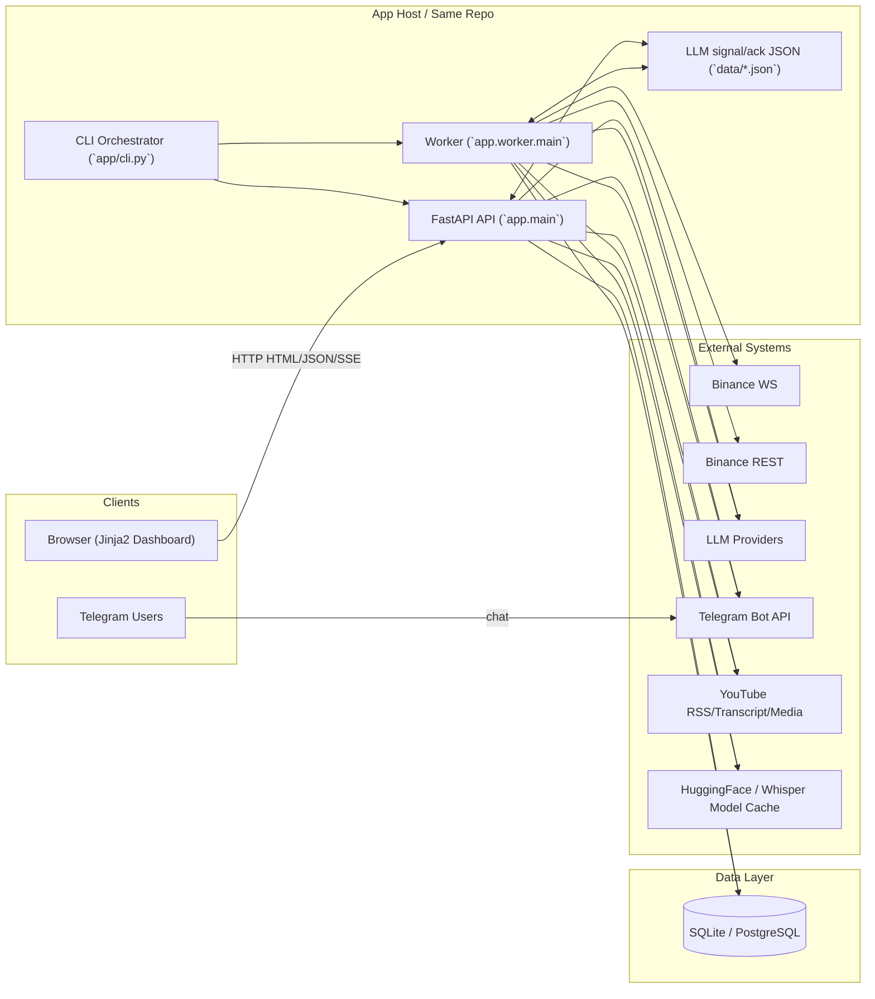
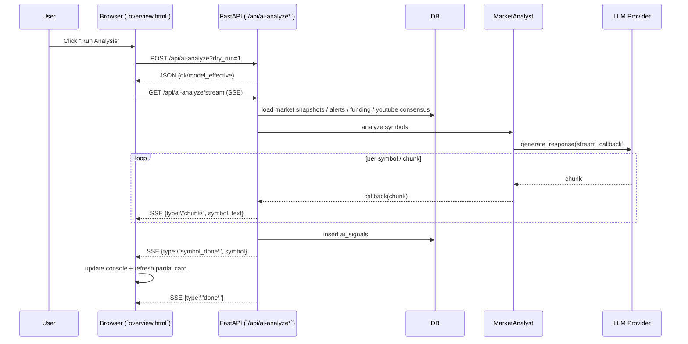
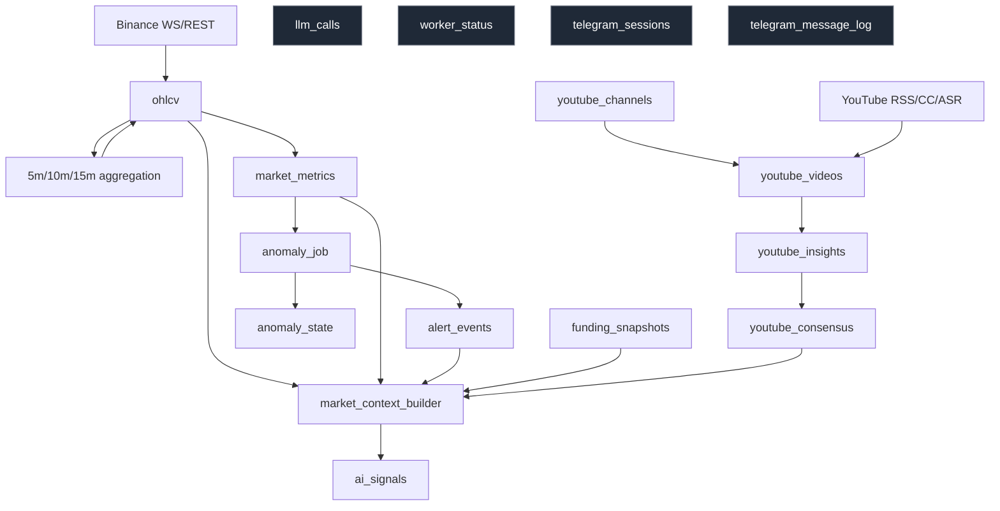
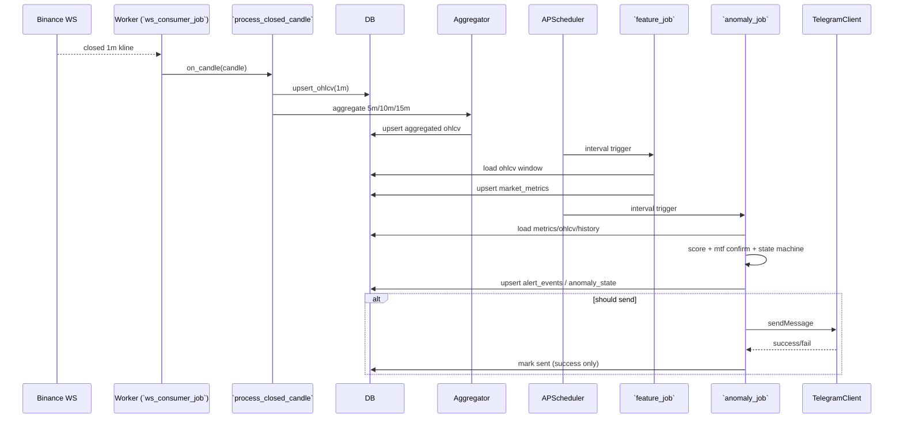
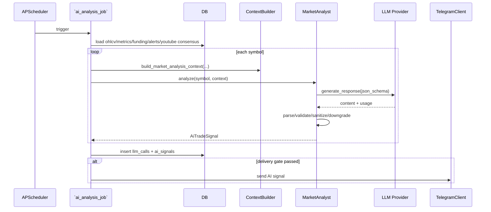
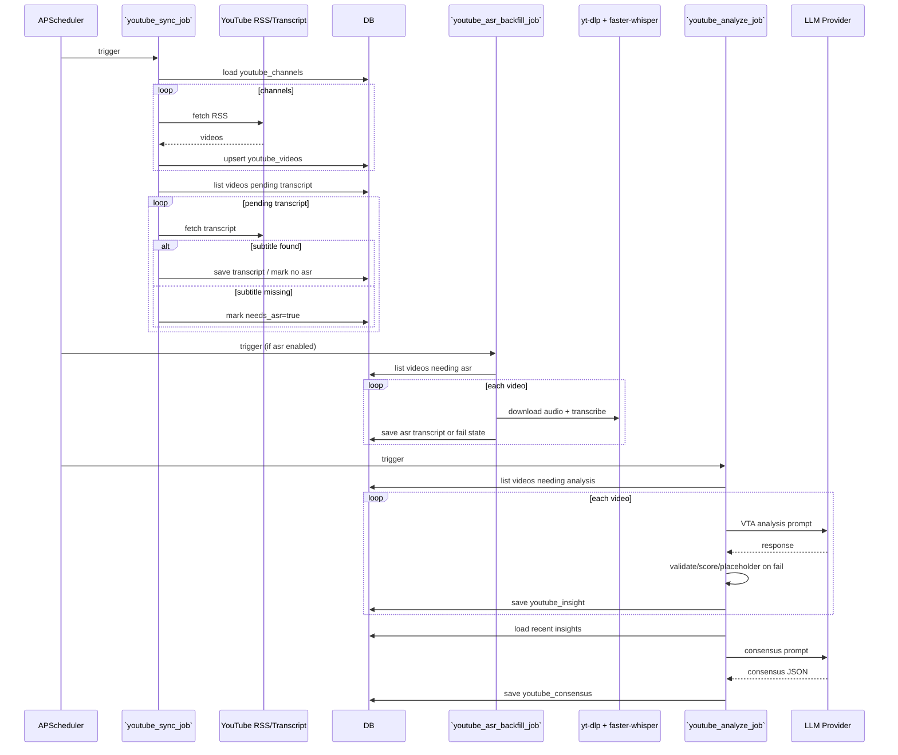
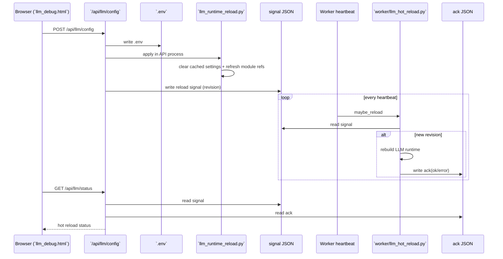
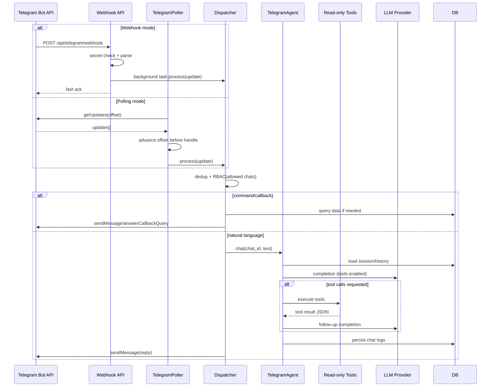
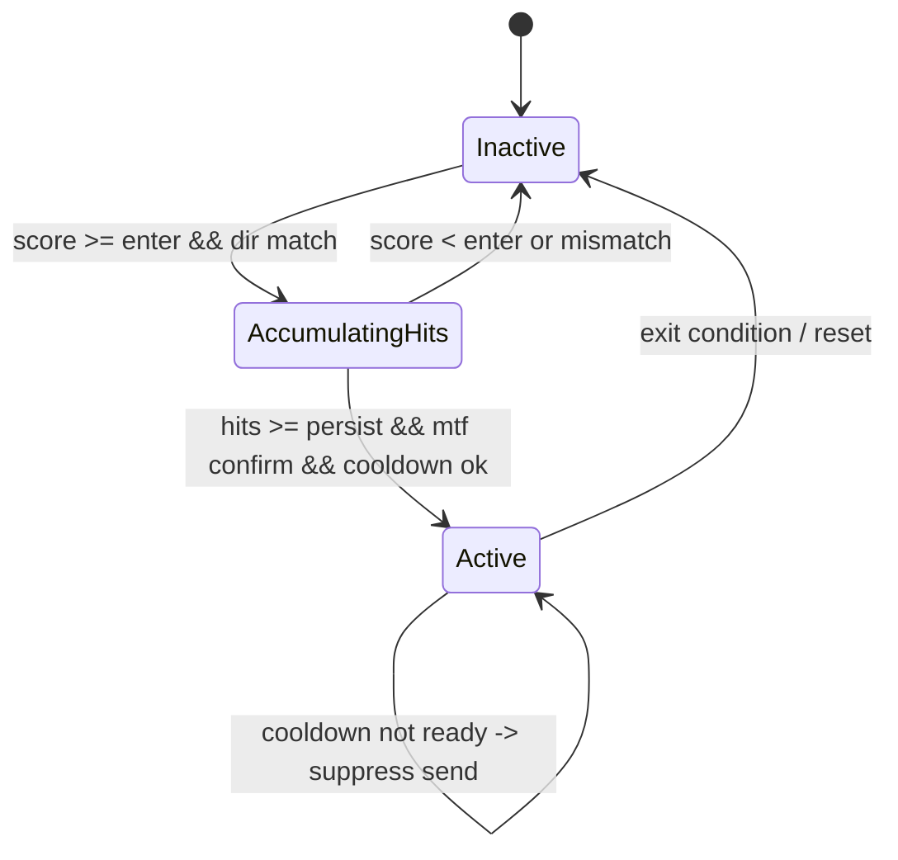
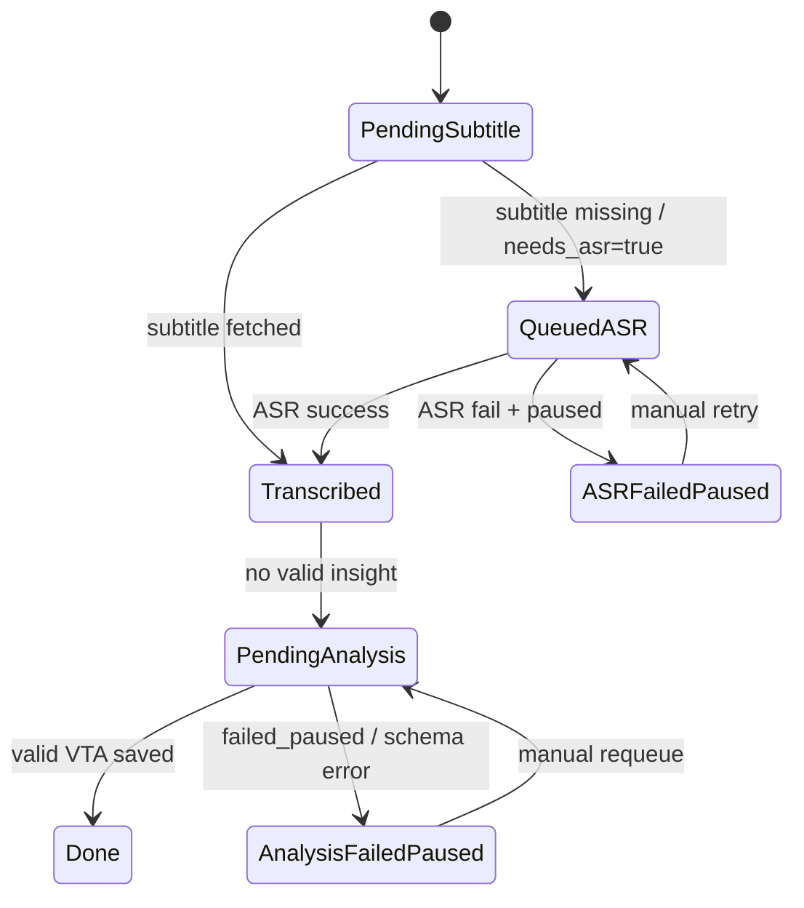

# Crypto Sentinel 系统架构与协作分析报告

> 文档版本：`v2.0`  
> 更新时间：`2026-03-02`  
> 生成口径：基于当前仓库代码实现（As-Is），并补充建议演进方向（To-Be）  
> 适用范围：`crypto_sentinel` 单体代码库（API + Worker 双进程协作）

## 目录

1. [摘要](#摘要)
2. [总体架构与技术栈](#总体架构与技术栈)
3. [前端技术选型与渲染流程](#前端技术选型与渲染流程)
4. [后端服务架构与 API 设计](#后端服务架构与-api-设计)
5. [前后端通信协议与数据交互机制](#前后端通信协议与数据交互机制)
6. [数据库设计与数据流](#数据库设计与数据流)
7. [调度器与 Worker 架构](#调度器与-worker-架构)
8. [核心功能模块业务逻辑拆解](#核心功能模块业务逻辑拆解)
9. [关键代码路径时序分析](#关键代码路径时序分析)
10. [状态机分析](#状态机分析)
11. [环境配置差异与部署策略](#环境配置差异与部署策略)
12. [性能瓶颈与优化方案](#性能瓶颈与优化方案)
13. [安全机制实现与风险分析](#安全机制实现与风险分析)
14. [错误处理与监控告警体系](#错误处理与监控告警体系)
15. [程序可改进的地方（全面问题清单）](#程序可改进的地方全面问题清单)
16. [后期拓展方向](#后期拓展方向)
17. [附录](#附录)

## 摘要

- `Crypto Sentinel` 代码形态是单体仓库，但运行态为 `CLI 编排 + API 进程 + Worker 进程 + 共享数据库` 的协作系统。
- 前端为 `FastAPI + Jinja2 模板 + 原生 JavaScript + SSE` 的服务端渲染方案，覆盖市场总览、告警中心、YouTube 观点与 LLM 调试。
- 核心技术栈：`FastAPI/Uvicorn`、`APScheduler`、`SQLAlchemy/Alembic`、`httpx/websockets`、`pandas/numpy`、`OpenAI-compatible LLM SDK`、`Pydantic Settings`。
- 主业务链路包含：行情采集/聚合 → 指标计算 → 异常检测/告警 → AI 市场分析 → Telegram 推送；YouTube 链路含视频发现 → 字幕/ASR → VTA 洞察 → 共识 → 注入 AI 上下文。
- 跨进程协作依赖数据库与 LLM 热更新的 signal/ack 文件协议；运维观测覆盖 `llm_calls`、`ai_analysis_failures` 与 `job_metrics` 文件快照。

## 总体架构与技术栈

### 现状实现

#### 运行与服务框架
- Python `>=3.11`（`pyproject.toml`）
- API：`FastAPI + Uvicorn`（`app/main.py`）
- 前端模板：`Jinja2`（`app/web/views.py`）
- Worker：`asyncio + APScheduler`（`app/worker/main.py`, `app/scheduler/scheduler.py`）
- 配置：`Pydantic Settings + .env`（`app/config.py`）
- 任务编排：CLI（`app/cli.py`, `sentinel up`）

#### 数据与迁移
- ORM：`SQLAlchemy 2.x`（`app/db/models.py`）
- 迁移：`Alembic`（`app/db/migrations/versions/*`）
- 默认数据库：`SQLite`
- 可选数据库：`PostgreSQL`（`docker-compose.yml`）

#### 外部集成
- 行情：Binance `REST + WebSocket`（`app/providers/binance_provider.py`）
- AI：`openai` SDK + 自定义 Provider 封装（`app/ai/openai_provider.py`）
- YouTube：`RSS / Transcript API / yt-dlp / faster-whisper`（`app/providers/youtube_provider.py`）
- 消息：Telegram Bot API（Webhook + Polling）

### 关键代码路径/模块

- 入口：`app/main.py`, `app/worker/main.py`, `app/cli.py`
- 配置中心：`app/config.py`
- 调度器：`app/scheduler/scheduler.py`
- 定时任务：`app/scheduler/jobs.py`

### 数据/控制流

- `CLI` 启动 API 与 Worker 两个子进程（`app/cli.py`）。
- API 负责页面渲染、管理接口、手动触发、SSE 流。
- Worker 负责行情订阅、周期任务、外部轮询、告警推送。
- 两进程通过共享数据库和 LLM 热更新文件信号协作。

### 风险与边界

- 单体代码库易部署，但核心文件（`app/web/views.py`, `app/scheduler/jobs.py`）职责聚合严重。
- DB 初始化路径存在 `Alembic` 与 `create_all` 混用，存在 schema 演进不一致风险。

### 目标方案（如适用）

- 保持单体代码库形态，优先做运行态治理：
- 统一迁移入口
- 增加管理接口鉴权
- 强化监控与告警
- 拆分超大模块，降低回归风险

### 系统总体架构图（System Architecture）

图示：当前运行态的核心组件、外部依赖、共享数据库与 LLM 热更新文件协作链路。



简要解读：
- API 与 Worker 不直接 RPC，主要通过 DB 和文件信号协作。
- 浏览器与 API 的长任务交互依赖 `SSE`。
- Telegram 入站支持 `Webhook`（API）与 `Polling`（Worker）两条链路。

## 前端技术选型与渲染流程

### 现状实现

当前前端是“服务端渲染 + 原生 JS 增量交互”的模板前端，而不是 SPA。

#### 页面与静态资源
- 页面模板：
- `app/web/templates/overview.html`
- `app/web/templates/alerts.html`
- `app/web/templates/youtube.html`
- `app/web/templates/llm_debug.html`
- 样式：
- `app/web/static/styles.css`
- Tailwind CDN（模板内加载）
- 图标/字体：
- Lucide CDN
- Google Fonts（模板内加载）
- 国际化：
- `app/web/static/i18n.js`

#### 渲染与交互模式
- 首屏：FastAPI + Jinja2 服务端渲染。
- 交互：浏览器使用原生 `fetch` 调用 JSON API。
- 长任务：使用 `EventSource` 消费 `SSE`（AI 分析流、ASR 进度）。
- 部分 UI 刷新采用“重新抓取页面 HTML 后局部替换”的策略（`overview.html`）。

### 关键代码路径/模块

- 路由与模板上下文：`app/web/views.py`
- 页面脚本：`app/web/templates/overview.html`, `app/web/templates/youtube.html`, `app/web/templates/llm_debug.html`
- I18N：`app/web/static/i18n.js`

### 数据/控制流

- API 从 DB 拉取快照、告警、AI 信号、YouTube 状态，渲染模板。
- 浏览器加载后以原生 JS 进行操作：
- 本地 DOM 过滤/排序
- 调用 `/api/*` 接口刷新
- 订阅 `SSE` 展示流式状态

### 风险与边界

- 模板内嵌大量 JS，维护性逐步变差。
- 对 CDN 的依赖不利于生产 CSP 与离线部署。
- `i18n.js` 与模板文本存在编码/字符显示异常风险（需统一 UTF-8 治理）。

### 目标方案（如适用）

- 继续保留模板前端，但做“模板前端工程化”：
- 抽离模板内脚本到静态 JS 模块
- 统一 API/SSE 客户端封装
- 本地化静态资源，降低 CDN 依赖

### 前端 AI 分析渲染时序图（overview）

图示：`overview` 页点击手动 AI 分析后的预检 + SSE + 局部刷新流程。



简要解读：
- 手动 AI 分析分为“预检接口 + 流式接口”两步。
- 当前前端对 AI 卡片的刷新并非纯 JSON patch，而是会重新拉取页面片段。

## 后端服务架构与 API 设计

### 现状实现

- 应用入口：`app/main.py`
- 主要路由模块：
- `app/web/views.py`（页面 + 大部分 API）
- `app/web/api_telegram.py`（Telegram Webhook）

### 关键代码路径/模块

- `app/main.py`
- `app/web/views.py`
- `app/web/api_telegram.py`

### API 路由矩阵（核心）

| 分组 | 方法 | 路径 | 返回 | 主要用途 |
|---|---|---|---|---|
| 页面 | GET | `/` | HTML | 市场总览页 |
| 页面 | GET | `/alerts` | HTML | 告警中心 |
| 页面 | GET | `/youtube` | HTML | YouTube 管理与分析页 |
| 页面 | GET | `/llm` | HTML | LLM 调试页 |
| 核心 | GET | `/api/market` | JSON | 市场快照 |
| 核心 | GET | `/api/alerts` | JSON | 告警列表 |
| 核心 | GET | `/api/health` | JSON | API/DB/Worker 健康状态 |
| 核心 | GET | `/api/models` | JSON | LLM 模型列表 |
| 核心 | GET | `/api/ai-signals` | JSON | AI 信号列表 |
| AI | POST | `/api/ai-analyze` | JSON | 手动触发 AI 分析（含 dry_run） |
| AI | GET | `/api/ai-analyze/stream` | SSE | 手动 AI 分析流 |
| YouTube | POST | `/api/youtube/sync` | JSON | 手动同步视频/字幕 |
| YouTube | GET | `/api/youtube/asr/model` | JSON | ASR 模型状态 |
| YouTube | POST | `/api/youtube/asr/model` | JSON/SSE | 下载 ASR 模型 |
| YouTube | POST | `/api/youtube/asr/{video_id}` | JSON/SSE | 手动 ASR 转写 |
| YouTube | GET | `/api/youtube/channels` | JSON | 频道列表 |
| YouTube | POST | `/api/youtube/channels` | JSON | 添加频道 |
| YouTube | DELETE | `/api/youtube/channels/{channel_id}` | JSON | 删除频道 |
| YouTube | GET | `/api/youtube/videos` | JSON | 视频列表/状态 |
| YouTube | GET | `/api/youtube/transcript/{video_id}` | JSON | 转写与洞察详情 |
| YouTube | POST | `/api/youtube/analyze/{video_id}` | JSON | 手动重排队 AI 分析 |
| YouTube | GET | `/api/youtube/consensus` | JSON | 最新观点共识 |
| LLM | GET | `/api/llm/config` | JSON | 读取 LLM 配置（脱敏） |
| LLM | POST | `/api/llm/config` | JSON | 写 `.env` 并触发热更新 |
| LLM | GET | `/api/llm/status` | JSON | 热更新状态与 ACK |
| LLM | GET | `/api/llm/calls` | JSON | LLM 调用日志 |
| LLM | GET | `/api/llm/failures` | JSON | LLM 解析/校验失败记录 |
| LLM | POST | `/api/llm/selfcheck` | JSON | LLM 连通性自检 |
| Telegram | POST | `/api/telegram/webhook` | JSON | Telegram Webhook 入站 |
| Ops | GET | `/api/ops/jobs` | JSON | 任务执行统计与快照 |

### 数据/控制流

- 页面路由：DB -> Jinja2 -> HTML
- 普通 API：DB/外部系统 -> JSON
- 长任务 API：生成器/后台任务 -> `SSE`
- 管理 API：写 `.env` / 写 DB / 触发下载或分析

### 风险与边界

- `app/web/views.py` 路由集中，文件过大。
- 管理型 API（LLM 配置、ASR 下载、手动分析）默认无统一鉴权，生产风险高。

### 目标方案（如适用）

- 按领域拆分 router：`pages`, `api_market`, `api_ai`, `api_youtube`, `api_llm`
- 管理 API 必须加鉴权与审计
- 流式与高成本接口增加限流与配额

## 前后端通信协议与数据交互机制

### 现状实现

| 通信方向 | 协议 | 载荷 | 代表模块 |
|---|---|---|---|
| Browser -> API | HTTP | HTML / JSON | `app/web/views.py` |
| Browser -> API | SSE | `text/event-stream` | `/api/ai-analyze/stream` 等 |
| Worker -> Binance | WebSocket | JSON | `app/providers/binance_provider.py` |
| API/Worker -> 外部系统 | HTTPS | JSON / XML / HTML | `httpx` 调用 |
| Telegram -> API | HTTPS Webhook | JSON | `app/web/api_telegram.py` |
| Worker -> Telegram | HTTPS Polling/API | JSON | `app/alerts/telegram_poller.py`, `app/alerts/telegram.py` |
| API <-> Worker | 文件协议 | JSON signal/ack | `app/ai/llm_runtime_reload.py`, `app/worker/llm_hot_reload.py` |
| API/Worker <-> DB | SQLAlchemy | ORM/SQL | `app/db/*` |

### 关键代码路径/模块

- SSE：`app/web/views.py`
- Binance WS：`app/providers/binance_provider.py`
- Telegram Webhook/Polling：`app/web/api_telegram.py`, `app/alerts/telegram_poller.py`
- LLM 热更新文件协作：`app/ai/llm_runtime_reload.py`, `app/worker/llm_hot_reload.py`

### 数据/控制流

- 前端长任务通过 SSE 获取 token/chunk/阶段性进度。
- Worker 行情采集使用 Binance WS，补数/多周期同步使用 REST。
- API 与 Worker 的 LLM 热更新采用“signal -> heartbeat 应用 -> ack”的最终一致机制。

### 风险与边界

- SSE 缺少统一的断连取消策略。
- 文件协议适用于单机/共享卷，不适合多副本 Worker。

### 目标方案（如适用）

- 保留 SSE 用于运维型 UI（足够轻量）。
- 多实例部署时改用 DB 表或消息队列传递热更新事件。

## 数据库设计与数据流

### 现状实现

数据模型定义在 `app/db/models.py`，仓储逻辑在 `app/db/repository.py`。大量结构化扩展字段使用 JSON 存储以提高灵活性。

### 关键代码路径/模块

- 模型：`app/db/models.py`
- Session/Engine：`app/db/session.py`
- 仓储：`app/db/repository.py`
- 迁移：`app/db/migrations/versions/*`

### 表模型清单（按域）

| 域 | 表 | 用途 |
|---|---|---|
| 市场数据 | `ohlcv` | 原始与聚合 K 线（1m/5m/10m/15m/1h/4h） |
| 市场指标 | `market_metrics` | 指标结果（RSI/MACD/ATR/BB/OBV 等） |
| 告警事件 | `alert_events` | 异常告警记录与去重 UID |
| 告警状态机 | `anomaly_state` | 告警状态持久化（hit/cooldown/active） |
| 资金费率 | `funding_snapshots` | Funding/OI 快照 |
| AI 信号 | `ai_signals` | LLM 信号与分析 JSON |
| Worker 状态 | `worker_status` | 心跳/版本/运行状态 |
| YouTube | `youtube_channels` | 频道配置 |
| YouTube | `youtube_videos` | 视频元数据/字幕/ASR 状态 |
| YouTube | `youtube_insights` | 单视频 AI 洞察（VTA） |
| YouTube | `youtube_consensus` | 聚合共识结果 |
| LLM 观测 | `llm_calls` | 调用日志、耗时、错误摘要、tokens |
| LLM 失败 | `ai_analysis_failures` | AI 解析/校验失败事件 |
| Telegram 记忆 | `telegram_sessions` | 会话上下文/偏好 |
| Telegram 审计 | `telegram_message_log` | 对话与工具调用日志 |
| 模型版本 | `model_versions` | 预留模型版本登记 |

### 数据/控制流

- 行情数据：
- Binance -> `ohlcv` -> 聚合 -> `market_metrics` -> `alert_events` / `anomaly_state`
- AI 分析：
- `ohlcv` + `market_metrics` + `funding_snapshots` + `alert_events` + `youtube_consensus` -> `ai_signals`
- YouTube 分析：
- `youtube_channels` -> `youtube_videos` -> transcript/ASR -> `youtube_insights` -> `youtube_consensus`
- 运维观测：
- LLM 调用 -> `llm_calls`
- LLM 失败 -> `ai_analysis_failures`
- Worker 心跳 -> `worker_status`
- Telegram 交互 -> `telegram_sessions`, `telegram_message_log`

### 数据流图（Mermaid）

图示：核心业务链路在 DB 中的生产、消费、回写路径。



简要解读：
- `ohlcv` 是基础事实层。
- `market_metrics` 与 `funding_snapshots` 为异常与 AI 的关键输入。
- YouTube 观点数据以 `youtube_consensus` 形式进入 AI 上下文。

### 风险与边界

- JSON 字段灵活但不利于复杂查询与约束。
- 多数逻辑关联缺少数据库外键约束，依赖应用层维护一致性。
- `ai_signals` 缺少强业务去重约束，手动/定时并发可能产生重复记录。

### 目标方案（如适用）

- 保留 JSON 扩展字段，但补关键约束与索引。
- 统一通过 Alembic 管理 schema 演进。
- 为高频查询增加批量读取与复合索引。

## 调度器与 Worker 架构

### 现状实现

- Worker 入口：`app/worker/main.py`
- 调度器定义：`app/scheduler/scheduler.py`
- 任务实现：`app/scheduler/jobs.py`
- 模式：`asyncio + APScheduler + Binance WS 常驻消费者`

### 关键代码路径/模块

- `app/worker/main.py`
- `app/scheduler/scheduler.py`
- `app/scheduler/jobs.py`
- `app/providers/binance_provider.py`

### 数据/控制流

- Worker 启动：
- 初始化 DB/日志/运行态
- 构建 LLM Provider（market/youtube）
- 可选启动 Telegram Polling
- 启动 `APScheduler`
- 启动常驻 `ws_consumer_job`
- 周期任务并行推进市场、AI、YouTube、运维链路。

### 调度任务矩阵（核心）

| Job ID | 类型 | 说明 | 开关条件 |
|---|---|---|---|
| `heartbeat_job` | interval | Worker 心跳 + 热更新检查 | 总是启用 |
| `gap_fill_job` | interval | 1m K 线补缺与聚合修复 | 总是启用 |
| `feature_job` | interval | 指标计算（1m） | 总是启用 |
| `anomaly_job` | interval | 异常评分、状态机、推送 | 总是启用 |
| `multi_tf_sync_job` | interval | 1h/4h 同步与指标 | 总是启用 |
| `funding_rate_job` | interval | Funding/OI 快照同步 | 总是启用 |
| `ai_analysis_job` | interval | 定时 AI 市场分析 | LLM 启用 |
| `youtube_sync_job` | interval | 视频发现/字幕抓取 | `youtube_enabled` |
| `youtube_analyze_job` | interval | 视频 AI 分析/共识 | `youtube_enabled` |
| `youtube_asr_backfill_job` | interval | 本地 ASR 补录 | `youtube_enabled && asr_enabled` |

### 风险与边界

- `app/scheduler/jobs.py` 体量过大，逻辑分层不清晰。
- 多任务共享外部 API 与 DB 资源，缺少统一背压/并发预算控制。

### 目标方案（如适用）

- 拆分 `jobs.py` 为按域模块。
- 为重任务（AI、ASR）增加并发限制与队列化。
- 增加任务级 metrics（耗时/成功率/异常类型）。

## 核心功能模块业务逻辑拆解

### 1. 市场数据采集与聚合

#### 现状实现
- `BinanceProvider.consume_kline_stream()` 消费 WS 闭合 kline（`app/providers/binance_provider.py`）
- `process_closed_candle()` 写入 `ohlcv` 并聚合 5m/10m/15m（`app/scheduler/jobs.py`, `app/features/aggregator.py`）
- `gap_fill_job()` 与 `startup_backfill_job()` 使用 REST 补数

#### 风险与边界
- WS 与 REST 都会写入 `ohlcv`，幂等依赖 upsert 实现。

### 2. 指标计算（Feature Pipeline）

#### 现状实现
- `feature_job` 支持增量与全量两种路径（`app/scheduler/jobs_feature.py`）
- 增量模式：`compute_and_store_pending_metrics()` 以“最新指标时间”为游标，批量回看窗口并增量写入（`app/features/feature_pipeline.py`）
- 全量模式：`compute_and_store_latest_metric()` 读取窗口 K 线计算指标并 upsert `market_metrics`

#### 风险与边界
- 增量模式仍依赖 `pandas` 与回看窗口，watchlist 扩大后 CPU/内存压力明显。
- backlog 未清空时会出现“落后计算”的时间漂移，需要监控与限流兜底。

### 3. 异常检测与状态机

#### 现状实现
- `score_anomaly_snapshot()` 计算价格/量能/波动/结构等评分（`app/signals/anomaly.py`）
- `compute_mtf_confirmation()` 做 5m/15m 方向确认
- `anomaly_job()` 使用 `AnomalyState` 做持久化状态机控制与 Telegram 触发（`app/scheduler/jobs.py`）

#### 风险与边界
- 状态机语义复杂（预算、冷却、节流、确认条件），集中在 `jobs.py` 中，可维护性一般。

### 4. AI 市场分析（LLM）

#### 现状实现
- 上下文：`build_market_analysis_context()`（`app/ai/market_context_builder.py`）
- Prompt：`build_analysis_prompt()`（`app/ai/prompts.py`）
- 分析器：`MarketAnalyst.analyze()` 负责调用 LLM、解析 JSON、校验/降级（`app/ai/analyst.py`）
- 触发入口：
- 定时任务 `ai_analysis_job()`
- 手动 API `/api/ai-analyze`、`/api/ai-analyze/stream`

#### 风险与边界
- 上游 LLM 质量、延迟、限流直接影响结果稳定性。
- 输出 schema 演化对 JSON 解析兼容性要求高。

### 5. YouTube 观点链路

#### 现状实现
- `youtube_sync_job()`：
- RSS 拉取新视频（`app/providers/youtube_provider.py`）
- 尝试抓取字幕（Transcript API）
- 标记 `needs_asr`
- `youtube_asr_backfill_job()`：
- `yt-dlp` 下载音频 + `faster-whisper` 本地 ASR
- `youtube_analyze_job()`：
- 生成单视频 VTA 洞察
- 评分与失败占位
- 生成 `youtube_consensus`
- 分析运行态通过 `youtube_videos` 的 `analysis_runtime_*` 字段对外可视（API/UI 可读）
- `POST /api/youtube/analyze/{video_id}` 支持人工重排队

#### 风险与边界
- 外部平台变化、字幕缺失、ASR 资源耗费大。
- 手动 ASR 路径的线程与 DB session 使用需要重点治理（见改进项）。

### 6. Telegram 告警与交互

#### 现状实现
- 出站消息：`app/alerts/telegram.py`
- 入站：
- Webhook：`app/web/api_telegram.py`
- Polling：`app/alerts/telegram_poller.py`
- Dispatcher：`app/alerts/telegram_dispatcher.py`
- Agent：`app/alerts/telegram_agent.py` + `app/agents/tools/*`（当前为 read-only）

#### 风险与边界
- Polling 使用 at-most-once 语义（先推进 offset，再处理 update），失败消息会被跳过。

### 7. LLM 调试与热更新

#### 现状实现
- `/api/llm/config` 修改 `.env` 中 LLM 配置（`app/web/views.py`）
- API 进程即时刷新配置引用（`app/ai/llm_runtime_reload.py`）
- 写 signal JSON；Worker 在 `heartbeat_job` 内应用并写 ack（`app/worker/llm_hot_reload.py`）
- LLM Debug 页面展示模型目录/分层与运行状态，并支持查看 `/api/llm/calls` 与 `/api/llm/failures`

#### 风险与边界
- 单机实用，但不适合多副本 Worker。
- 管理接口未鉴权时存在高风险。

## 关键代码路径时序分析

### 1. Worker 市场数据处理主链路

图示：行情进入后如何落库、聚合、计算指标、做异常检测并触发推送。



简要解读：
- 行情摄取、指标计算、异常检测是阶段式松耦合流水线。
- 告警落库与推送分离，有利于幂等与可追溯。

### 2. Worker 定时 AI 分析链路（`ai_analysis_job`）

图示：定时 AI 市场分析从上下文构建到信号落库与推送。



简要解读：
- 手动 AI 与定时 AI 共用 `MarketAnalyst`，差异主要在触发方式与交互输出（SSE vs 后台任务）。

### 3. YouTube 处理链路（sync -> ASR -> analyze -> consensus）

图示：YouTube 数据从发现视频到形成共识的多阶段流水线。



简要解读：
- 该链路是多阶段异步流水线，允许局部失败停留并人工重试。
- 视频“状态”由 `youtube_videos + youtube_insights` 联合推导，而非单字段状态机。

### 4. LLM 热更新链路（UI -> API -> Worker）

图示：LLM 配置热更新跨进程生效路径。



简要解读：
- 热更新是最终一致，生效延迟取决于 `heartbeat_job` 周期。
- 单机方案简洁，但多实例需要中心化事件分发。

### 5. Telegram 入站协作链路（Webhook / Polling -> Dispatcher -> Agent）

图示：Telegram 入站消息从接收、路由、Agent 推理到回复发送。



简要解读：
- Polling 模式是明确的 at-most-once 语义，可靠性取舍偏“不中断主循环”。
- Agent 仅开放 read-only tools，安全边界相对克制。

## 状态机分析

### 1. 异常告警状态机（AnomalyState）

图示：`anomaly_job()` 依赖 `anomaly_state` 表实现的核心状态流转。



简要解读：
- 实际实现还叠加分桶节流、极端未确认旁路等条件，图中为核心抽象。

### 2. YouTube 视频处理状态图（推导态）

图示：YouTube 视频“状态”由数据字段推导而来，不是单一状态字段。



简要解读：
- 该设计灵活但状态语义分散，需要更好的文档与测试兜底。

## 环境配置差异与部署策略

> 本章节使用 `现状（As-Is） / 目标方案（To-Be） / 差距（Gap）` 三段式。

### 现状（As-Is）

#### 配置与启动
- 配置集中在 `.env` 与 `app/config.py`
- 默认 DB：`SQLite`（`DATABASE_URL=sqlite:///./data/crypto_sentinel.db`）
- 本地启动：
- `scripts/start.ps1`, `start.sh`, `start.bat`
- `python -m app.cli up ...`
- 容器启动：
- `docker-compose.yml`（`db`, `api`, `worker`）

#### 环境能力现状
- `dev/local`：可用
- `docker-compose`：可用
- `test/stage/prod`：未形成独立配置分层与发布流程

### 目标方案（To-Be）

#### 环境差异矩阵（建议）

| 维度 | Dev | Test | Stage | Prod |
|---|---|---|---|---|
| DB | SQLite/本地 PG | 临时 PG | 独立 PG | 托管/高可用 PG |
| 配置 | `.env.dev` | CI 注入 `.env.test` | `.env.stage` + secrets | secrets manager |
| Telegram | 可 polling | 默认关闭/测试 bot | stage bot + webhook | prod bot + webhook |
| YouTube/ASR | 可选开启 | 默认关闭 | 限量开启 | 配额控制开启 |
| LLM 热更新 | 可开启 | 固定配置为主 | 开启并审计 | 开启并鉴权审计 |
| 鉴权 | 可弱化 | CI 内部 | 必须启用 | 必须启用 |
| 日志 | INFO/DEBUG | INFO | INFO | 结构化 INFO/WARN |

#### 目标部署策略
- Stage/Prod 使用统一容器镜像。
- API 与 Worker 独立部署与重启。
- 发布前执行 `alembic upgrade head`。
- 反向代理负责 TLS 与外层鉴权。
- Secrets 不落地到可写 `.env`（至少生产环境）。

### 差距（Gap）

- 当前存在 DB 初始化路径不一致：
- `app/cli.py` 路径包含 Alembic 初始化逻辑
- `docker-compose.yml` 走 `scripts/init_db.py`（`create_all`）
- API/Worker 启动时也调用 `create_all`
- 缺失：
- 独立 `test/stage/prod` 配置集
- 管理接口鉴权
- 统一发布/回滚流程
- secrets 管理
- 标准化观测接入

### 目标部署架构图（To-Be）

图示：建议的预发布/生产部署拓扑（VM/Compose 风格，不预设 K8s）。

```mermaid
flowchart LR
    Internet["Operators / Users"] --> RP["Reverse Proxy (TLS/Auth)"]
    RP --> API["API Service (FastAPI/Jinja2)"]

    subgraph App["App Runtime"]
        API
        Worker["Worker Service (APScheduler + WS + Polling)"]
        Migrate["Migration Job (Alembic)"]
    end

    API --> PG[("PostgreSQL")]
    Worker --> PG
    Migrate --> PG

    API --> Shared["Shared Volume / Config Store"]
    Worker --> Shared

    API --> LLM["LLM Providers"]
    Worker --> LLM
    Worker --> Binance["Binance WS/REST"]
    API --> TG["Telegram Bot API (Webhook)"]
    Worker --> TG
    Worker --> YouTube["YouTube RSS/Subtitle/Media"]
    Worker --> HF["HuggingFace / Whisper Cache"]

    Obs["Logs / Metrics / Alerts"] <-- API
    Obs <-- Worker
    Obs <-- RP
```

简要解读：
- `Migrate` 应成为显式发布步骤，替代运行期隐式 `create_all`。
- 多副本部署时需要替换文件式热更新协议。

## 性能瓶颈与优化方案

### 现状实现

系统功能完整，但在扩展性与资源利用上存在典型“单机工具型”瓶颈。

### 问题清单与优化方向

| 问题 | 现状证据 | 影响 | 优化方向 |
|---|---|---|---|
| 仓储层 N+1 查询 | `app/db/repository.py` 多处按 symbol 循环查询最新数据 | watchlist 扩大后 DB 压力上升 | 批量 SQL + 分组聚合 |
| 指标计算增量仍需回看窗口 | `app/features/feature_pipeline.py` 增量也依赖回看窗口 | CPU 成本高 | 指标缓存/向量化优化 |
| 手动 AI 刷新整页 HTML | `overview.html` 通过 `fetch(location.href)` 局部替换 | 带宽/解析浪费 | 返回片段/JSON 增量接口 |
| `httpx` 客户端生命周期偏短 | 多处调用临时创建 client | 连接复用差 | Provider 层复用 AsyncClient |
| 手动 ASR/下载并发粗放 | `app/web/views.py` 内线程 + SSE | 资源耗尽风险 | 队列化 + 限并发 |
| SSE 断连取消缺失 | `/api/ai-analyze/stream` 后台任务可能继续运行 | 浪费 LLM 成本 | 断连检测 + task cancellation |
| 多任务缺统一背压 | APScheduler 多 job 并发共享 DB/外部 API | 锁竞争/响应抖动 | 任务优先级、错峰调度、并发预算 |
| SQLite 并发写瓶颈 | API/Worker 共写库 | 锁等待 | 生产强制 Postgres |
| YouTube 列表过滤偏 Python 层 | `/api/youtube/videos` 先读后筛 | 数据量增大变慢 | SQL 过滤 + 分页 |

### 风险与边界

- 提高并发会增加上游 API 限流风险，需配合退避与配额治理。
- AI 与 ASR 优化必须结合可观测性，否则问题更难定位。

### 目标方案（如适用）

- 短期：
- 批量查询优化
- 连接复用
- SSE 断连取消
- 手动任务并发限制
- 中期：
- AI/ASR 任务队列化
- 指标增量计算
- 分页与索引优化

## 安全机制实现与风险分析

### 现状实现（As-Is）

#### 已有机制
- Telegram Webhook secret 校验（`app/web/api_telegram.py`）
- Telegram `allowed_chat_ids` 白名单（`app/alerts/telegram_dispatcher.py`, `app/config.py`）
- LLM 配置读取时对 API key 做脱敏（`/api/llm/config` in `app/web/views.py`）
- 文件写入使用原子替换（如 signal/ack、poller offset）
- 部分 FastAPI 参数校验（`ge/le` 等）
- Telegram Agent 仅暴露 read-only tools（`app/alerts/telegram_agent.py`）

#### 风险与边界
- 高风险管理接口默认无鉴权：
- `/api/llm/config`
- `/api/youtube/asr/model`
- `/api/ai-analyze*`
- `.env` 明文持久化密钥，且可通过 UI 改写。
- 缺少统一认证/授权/审计/速率限制。
- 前端依赖外部 CDN，存在供应链与 CSP 风险。

### 目标方案（To-Be）

- 生产前必须完成：
- 管理页与管理 API 鉴权
- 高成本接口限流与审计
- secrets 管理（stage/prod 不直接写 `.env`）
- 可配置上游域名加 allowlist（尤其 LLM base URL）
- 建议增强：
- 结构化审计日志（谁修改了什么配置）
- 更严格的 webhook 重放保护与来源控制
- 静态资源本地化/版本固化

## 错误处理与监控告警体系

### 现状实现

#### 错误处理
- `supervised_job()` 统一包裹任务异常并记录日志（`app/scheduler/jobs.py`）
- Binance WS 断连重连与退避（`app/providers/binance_provider.py`）
- LLM 调用重试（429/连接问题）与退避（`app/ai/openai_provider.py`）
- Telegram 发送重试（`app/alerts/telegram.py`）
- Telegram Poller 网络/HTTP 异常恢复（`app/alerts/telegram_poller.py`）
- `/api/health` 提供 DB/API/Worker 心跳检查（`app/web/views.py`）

#### 监控与观测
- 日志：标准 logging（`app/logging.py`）
- DB 内观测表：
- `worker_status`
- `llm_calls`
- `ai_analysis_failures`
- 任务运行快照：`data/job_metrics.json`（`app/ops/job_metrics.py`）
- 运维接口：
- `/api/health`
- `/api/ops/jobs`
- `/api/llm/status`
- `/api/llm/calls`
- `/api/llm/failures`
- `/api/llm/selfcheck`
- CLI 诊断：`sentinel doctor`（`app/cli.py`）

### 风险与边界

- 缺少标准 metrics/tracing（Prometheus/OpenTelemetry）
- 日志非结构化，不利于聚合检索
- 缺少任务级连续失败告警与自动降级策略
- `supervised_job()` 仅记录日志，未做熔断与告警升级

### 目标方案（To-Be）

- 短期：
- 结构化 JSON 日志
- 关键 job 耗时/成功率指标
- 基于日志或 DB 的告警阈值
- 中期：
- Prometheus + Grafana
- Sentry 或 OpenTelemetry tracing
- 任务级连续失败告警与自动降级

## 程序可改进的地方（全面问题清单）

以下按主题给出“问题描述 / 当前影响 / 建议方向 / 关联路径”。

### 1. 架构与模块边界

- `app/web/views.py` 体量过大、职责混杂（页面/API/YouTube/LLM/SSE）  
  影响：维护与回归风险高  
  建议：按领域拆分 router 与 service  
  关联：`app/web/views.py`

- `app/scheduler/jobs.py` 聚合市场、AI、YouTube、运维逻辑  
  影响：复杂度高，测试难度大  
  建议：拆分为按域任务模块  
  关联：`app/scheduler/jobs.py`

- `Settings` 配置类过大且跨域聚合  
  影响：默认值与校验复杂，易引入配置误用  
  建议：按域拆分配置对象/校验  
  关联：`app/config.py`

### 2. 数据库与迁移治理

- Docker 路径使用 `create_all` 而非 Alembic  
  影响：schema 演进可能与开发环境不一致  
  建议：发布与容器启动统一走 `alembic upgrade head`  
  关联：`docker-compose.yml`, `scripts/init_db.py`

- API/Worker 启动阶段调用 `Base.metadata.create_all`  
  影响：掩盖迁移缺失问题  
  建议：生产环境禁用 `create_all`，保留开发开关  
  关联：`app/main.py`, `app/worker/main.py`

- 多表逻辑关联缺少 FK 约束  
  影响：脏数据难被数据库及时发现  
  建议：关键路径加 FK 或一致性巡检  
  关联：`app/db/models.py`

- `ai_signals` 缺少强业务去重约束  
  影响：手动/定时并发可能写入重复信号  
  建议：增加业务幂等键/唯一索引  
  关联：`app/db/models.py`, `app/db/repository.py`

### 3. 并发与线程安全

- 手动 ASR SSE 接口在线程中复用请求线程 SQLAlchemy Session（线程不安全）  
  影响：潜在崩溃、脏写、未定义行为  
  建议：线程内独立创建 Session，不跨线程共享  
  关联：`app/web/views.py`

- 手动 AI SSE 分析后台 task 缺少断连取消治理  
  影响：客户端断开后仍消耗 LLM 成本  
  建议：增加断连检测与任务取消传播  
  关联：`app/web/views.py`

- 手动 ASR/模型下载缺少全局并发控制  
  影响：CPU/GPU/IO 资源可能被打满  
  建议：互斥锁、任务队列、配额限制  
  关联：`app/web/views.py`

### 4. 性能与扩展性

- 仓储层多处 N+1 查询  
  影响：watchlist 增大后响应显著变慢  
  建议：批量查询与 SQL 侧聚合  
  关联：`app/db/repository.py`

- 指标计算周期性全窗口重算  
  影响：CPU 开销高  
  建议：增量指标计算或缓存状态  
  关联：`app/features/feature_pipeline.py`

- 前端 AI 分析刷新策略拉整页 HTML  
  影响：冗余网络与 DOM 解析  
  建议：提供片段接口或 JSON 增量更新  
  关联：`app/web/templates/overview.html`, `app/web/views.py`

- YouTube 列表过滤在 Python 层完成  
  影响：数据量增大时接口延迟升高  
  建议：SQL 过滤 + 分页 + 索引  
  关联：`app/web/views.py`

### 5. 安全与访问控制

- 管理接口未统一鉴权（尤其 `/api/llm/config`）  
  影响：配置篡改、密钥泄露、高成本调用滥用  
  建议：管理页/API 强制鉴权（应用内或反向代理）  
  关联：`app/web/views.py`

- LLM 配置通过 HTTP 改写 `.env` 明文落盘  
  影响：安全边界与审计能力不足  
  建议：stage/prod 使用 secrets 管理 + 审计日志  
  关联：`app/web/views.py`, `app/ai/llm_runtime_reload.py`

- 缺少高成本接口限流与成本保护  
  影响：误操作/恶意调用导致费用异常  
  建议：Rate limit + quota + 审计  
  关联：`app/web/views.py`

### 6. 可靠性与错误处理

- `supervised_job` 无连续失败统计与熔断  
  影响：任务长期异常不易自动降级  
  建议：增加失败计数、熔断、告警升级  
  关联：`app/scheduler/jobs.py`

- Polling 采用 at-most-once（先推进 offset）  
  影响：处理失败 update 永久丢失  
  建议：保留该策略但增加 dead-letter 记录与重放工具  
  关联：`app/alerts/telegram_poller.py`

- 部分同步/阻塞操作可能进入 async endpoint  
  影响：事件循环阻塞风险  
  建议：统一线程池/后台任务队列执行  
  关联：`app/web/views.py`

### 7. 可观测性与运维

- 日志非结构化  
  影响：难以聚合检索与告警  
  建议：JSON logging  
  关联：`app/logging.py`

- 缺少 metrics/tracing  
  影响：瓶颈定位与故障分析成本高  
  建议：Prometheus + OTel / Sentry  
  关联：全局

- LLM 调用观测已落库但缺少统一看板  
  影响：运维视图分散  
  建议：扩展 dashboard 或导出指标  
  关联：`app/db/repository.py`, `app/web/views.py`

### 8. 前端可维护性与体验

- 模板中嵌入大量脚本逻辑  
  影响：可测试性与复用性差  
  建议：拆分为静态 JS 模块  
  关联：`app/web/templates/*.html`

- 存在编码/乱码现象（文档/I18N/模板文本）  
  影响：界面与文档可读性受损  
  建议：统一 UTF-8 编码与校验流程  
  关联：`README.md`, `app/web/static/i18n.js`, `app/web/templates/*.html`

- `i18n.js` 维护方式脆弱  
  影响：易引入语法/编码问题且不易发现  
  建议：增加 i18n 资源校验测试  
  关联：`app/web/static/i18n.js`

### 9. 测试策略与质量门禁

- 系统级集成测试不足（跨进程/流式/并发路径）  
  影响：关键链路回归可能漏检  
  建议：增加 API + Worker 集成测试场景  
  关联：`tests/`

- 缺少 SSE 稳定性/断连测试  
  影响：流式接口回归风险高  
  建议：为 `/api/ai-analyze/stream` 增加协议级测试  
  关联：`app/web/views.py`, `tests/`

- 缺少 DB 迁移一致性测试（尤其 Compose 路径）  
  影响：部署时暴露 schema 差异  
  建议：增加 migration smoke test  
  关联：`docker-compose.yml`, `app/db/migrations/`

### 10. 部署工程化

- `docker/Dockerfile` 构建层级可继续优化  
  影响：构建耗时与缓存利用率一般  
  建议：精简依赖安装步骤、固定层顺序  
  关联：`docker/Dockerfile`

- Compose 当前偏开发态使用方式  
  影响：不适合作为直接生产方案  
  建议：补充 stage/prod compose 或部署清单与运行手册  
  关联：`docker-compose.yml`

- 缺少发布/回滚 runbook  
  影响：运维操作风险高  
  建议：补充迁移顺序、健康检查、回滚步骤文档  
  关联：建议新增 `docs/runbook*.md`

### 11. LLM 与业务策略治理

- 模型注册表与推荐模型部分硬编码  
  影响：模型更新时维护成本高  
  建议：模型目录配置化 + 可用性探测  
  关联：`app/config.py`, `app/web/views.py`

- `MarketAnalyst` 日志可能记录较大 prompt 内容  
  影响：日志膨胀与潜在敏感信息泄露  
  建议：生产环境降低日志粒度并脱敏  
  关联：`app/ai/analyst.py`

- `signals/decision.py` 基本为空实现  
  影响：策略层抽象与演进路线尚未落地  
  建议：定义 V2 决策接口与兼容契约  
  关联：`app/signals/decision.py`

## 后期拓展方向

1. 业务扩展
- 多交易所与多市场支持：新增 OKX/Bybit 统一 Provider 抽象与容灾切换。
- 策略引擎与回测：在 `signals` 层补齐策略 DSL、回测与实盘对照。
- 风控与仓位管理：新增风险预算、最大回撤约束与资金管理模块。

2. 架构演进
- 任务队列化：YouTube/AI/ASR 迁移到队列消费，降低 APScheduler 负载。
- 多实例协作：替换文件式热更新为 DB/消息队列事件，支持多 Worker。
- 数据服务化：拆分 Market/YouTube/AI 为独立服务或子包，便于迭代。

3. 可观测与成本治理
- Prometheus/OTel/Sentry 全链路观测与告警。
- LLM 成本审计与配额管理，按任务/用户/频道分账。
- 任务失败自动降级与重试策略中心化配置。

4. 产品化能力
- 独立 API 网关与鉴权（Key/JWT/签名）。
- 角色权限与审计日志体系。
- Dashboard 指标化与可视化报表（告警命中率、策略胜率、成本曲线）。

## 附录

### 附录 A：配置域分类（`.env.example` / `app/config.py`）

- 基础运行：`APP_ENV`, `LOG_LEVEL`, `TIMEZONE`, `APP_VERSION`
- 数据库：`DATABASE_URL`
- 市场与调度：`WATCHLIST`, `POLL_SECONDS`, `KLINE_SYNC_SECONDS`, `GAP_FILL_INTERVAL_SECONDS`
- 异常检测：`ANOMALY_*`, `SPIKE_*`, `BREAKOUT_LOOKBACK`
- Telegram：`TELEGRAM_*`
- LLM：`*_API_KEY`, `LLM_PROFILES_JSON`, `LLM_TASK_ROUTING_JSON`, `LLM_HOT_RELOAD_*`
- AI 分析：`AI_ANALYSIS_INTERVAL_SECONDS`, `AI_SIGNAL_CONFIDENCE_THRESHOLD`, `AI_HISTORY_CANDLES`
- 多周期与资金费率：`MULTI_TF_*`, `FUNDING_RATE_SYNC_SECONDS`, `BINANCE_FUTURES_URL`
- YouTube 与 ASR：`YOUTUBE_*`, `ASR_*`

### 附录 B：关键模块索引

- 入口与编排：`app/main.py`, `app/worker/main.py`, `app/cli.py`
- 路由与页面：`app/web/views.py`, `app/web/api_telegram.py`, `app/web/templates/*.html`
- 数据层：`app/db/models.py`, `app/db/repository.py`, `app/db/session.py`
- 调度与任务：`app/scheduler/scheduler.py`, `app/scheduler/jobs.py`
- 市场与信号：`app/providers/binance_provider.py`, `app/features/*`, `app/signals/anomaly.py`
- AI：`app/ai/analyst.py`, `app/ai/market_context_builder.py`, `app/ai/prompts.py`, `app/ai/openai_provider.py`
- YouTube：`app/providers/youtube_provider.py`
- Telegram：`app/alerts/telegram.py`, `app/alerts/telegram_poller.py`, `app/alerts/telegram_dispatcher.py`, `app/alerts/telegram_agent.py`
- LLM 热更新：`app/ai/llm_runtime_reload.py`, `app/worker/llm_hot_reload.py`
- 部署与脚本：`docker-compose.yml`, `docker/Dockerfile`, `scripts/init_db.py`

### 附录 C：后续文档建议（非本次实现）

- `docs/runbook_deploy.md`（部署/回滚操作手册）
- `docs/api_reference.md`（路由与返回结构清单）
- `docs/operations_guide.md`（告警/LLM/YouTube 运维手册）
